# LOICollectionA Native UI 设计剖析：从 JSON 表单到声明式 GUI 系统  

没错，这是我的第一篇 《我的世界》 基岩版 C++ LeviLamina 模组开发教程(～￣▽￣)～

在该篇教程里，我将详细讲解 LOICollectionA 中对于 frontend 的设计理念，并带你深入理解其具体的 `脚本语言` 解析器运行逻辑，最后我将带你看看在 LOICollectionA 中如何打通 C++ 原生层与脚本层面的互动，并从头实现一个自己的 `声明式` GUI

---

## 目录

1. 第一部分：详解 `Lexer`（`词法解析器`） 和 `Parser`（`语法分析器`）的设计理念
2. 第二部分：深入理解 `SemanticAnalyzer`（`语义分析器`），以及为什么它是类型安全的守门员
3. 第三部分：理解 `Compiler`（`编译器`），以及为什么选择 `访问者模式` 而不是 `模式匹配`
4. 第四部分：明晰 `Optimizer`（`优化器`）的运行逻辑，以及为什么它是编程语言中最必不可少的部分
5. 第五部分：了解 `VM`（`虚拟机`）的整体实现，以及为何不选择 `线程化解释器`
6. 第六部分: 关于 `GUIManager` 的设计范式
7. 第七部分：如何创建你自己的 `声明式` GUI

---

在教程正式开始之前，请你想想一个具体的情景：  
在 LeviLamina 26.20.7 版本中首次支持了 `数据驱动 UI`（`DataDrivenUI`，后文统一简称为 `DDUI`），这意味着在原生模组层面对于动态 GUI 是可能的。但是当你想为服务器的 Menu 适配这个功能时，你会发现传统 JSON 表单的动态修改能力极其有限。换句话说，在传统 JSON 表单里实现 `DDUI` 是很困难的事。就算能实现，那整体的设计范式也极为复杂，难以阅读。

以 LOICollectionA 1.14.0 中 Menu 模块的传统 JSON 表单为例：

```json
{
    "main": { // 表单 ID（同时 main 也为表单入口，不可不存在）
        "title": "'Menu Example'", // 表单标题
        "content": "'This is a menu example'", // 表单内容
        "info": { // 部分功能提供（可选）
            "exit": "execute as ${player} run say Exit Menu", // 玩家退出表单时执行命令（其中 ${player} 代表玩家名称）
            "permission": "execute as ${player} run say You do not have permission to use this button", // 使用部分按钮时，玩家没有权限时所执行命令
            "score": "execute as ${player} run say You do not have enough score to use this button" // 使用部分按钮时，玩家没有足够 Score 时所执行命令
        },
        "type": "Simple", // 表单类型 （Simple 类似于按钮列表）
        "customize": [ // 按钮列表
            {
                "title": "'Header'", // 控件标题
                "id": "Header", // 控件 ID（不可重复）
                "type": "header" // 控件类型（header 为标题）
            },
            {
                "title": "'Label'", // 控件标题
                "id": "Label", // 控件 ID（不可重复）
                "type": "label" // 控件类型（label 为标签）
            },
            {
                "id": "Divider", // 控件 ID（不可重复）
                "type": "divider" // 控件类型（divider 为分割线）
            },
            {
                "title": "'Button 1'", // 按钮标题
                "image": "",  // 按钮图标（可选，只支持 path 类型）
                "id": "Button1", // 按钮 ID（不可重复）
                "scores": { // 按钮所需的 Score（可选）
                    "money": 100 // 按钮所需的 Score 分数
                },
                "run": [ // 使用该按钮时，当所有条件都满足时，所执行的命令（其中 ${player} 代表玩家名称）
                    "execute as ${player} run say Button1",
                    "execute as ${player} run say Button1 - 1"
                ],
                "type": "button", // 按钮类型（button 为按钮）
                "permission": 0 // 按钮所需的权限等级（0 为无需权限）
            },
            {
                "title": "'From 1'",
                "image": "",
                "id": "Form1",
                "scores": {},
                "run": "Menu1", // 使用该按钮时，当所有条件都满足时，所打开的表单 ID
                "type": "from", // 按钮类型（from 为表单）
                "permission": 0
            },
            {
                "title": "'From 2'",
                "image": "",
                "id": "Form2",
                "scores": {},
                "run": "Menu2",
                "type": "from",
                "permission": 0
            },
            {
                "title": "'OP Button 1'",
                "image": "",
                "id": "Button2",
                "run": [ 
                    "execute as ${player} run say OPButton1"
                ],
                "type": "button",
                "permission": 2 // 按钮所需的权限等级（2 为 OP 权限）
            },
            {
                "title": "'OP From 1'",
                "image": "",
                "id": "Button3",
                "run": "Menu1",
                "type": "from",
                "permission": 2
            }
        ],
        "permission": 0 // 表单所需的权限等级
    }
}
```

你发现了什么？( •̀ ω •́ )✧......没错！单以写一个经典的 SimpleForm，就得要写这么多的 json 内容。更别说在 `DDUI` 层面，这是难以依据 `ObservableXXX`（如 `ObservableString`，`ObservableNumber`等） 实现动态表单的。

比如：你想让一个按钮的文字根据玩家金币数实时变化，在传统 JSON 表单里几乎不可能。

所以在正常实现中，你要想完成这个功能，要么写 C++ 模组，要么写 .js（LSE）脚本。但这并非彻底否决传统 JSON 表单在 `DDUI` 的可实现性，我将在第七部分给出一个具体、可行的设计范式。

这就是为什么你需要实现一个完整的 `脚本语言` 解析器。毕竟这样你才能以一种较为简洁的方式，在编码逻辑里创建自己的表单。(｡･∀･)ﾉﾞ

---

## 第一部分：详解 `Lexer`（`词法解析器`） 和 `Parser`（`语法分析器`）的设计理念

`脚本语言` 解析器最重要的是什么呢？对，就是 `Lexer`（`词法解析器`） 和 `Parser`（`语法分析器`）。它们如同解析器的眼睛，没有它们，解析器无异于盲人摸象，无法解析文本，无法理解程序为什么要这么执行。

接下来的篇幅不绕弯子，直接看 `Lexer` 的实现，以及它为什么这么重要。

### Lexer 词法解析器

先看 LOICollectionA 1.15.0 中 Lexer 的关键实现：

```cpp
enum class TokenType {
    TOKEN_IF, TOKEN_LPAREN, TOKEN_RPAREN, TOKEN_LBRCKET, //... TOKEN_EOF
};

struct Token {
    TokenType type;
    std::string value;
    SourceLocation loc;
};

class Lexer {
    std::string input;

    // line, position, diagnostics ...

public:
    Lexer(std::string str, DiagnosticEngine& diag);

    void advance();

    Token getNextToken();
    Token peekNextToken();

private:
    Token parseString(char delimiter);
    Token parseIdentifier();

    // parseNumber(), parseColon() ...

    void skipWhitespace();
    void skipComment();

    char peekChar() const;

    Token makeToken(TokenType type);
};
```

它分为 `TokenType`（词元类型），`Token`（词元）和 `Lexer` 组成。其中 `Lexer` 接收一个原生 `脚本文本` 和 错误集中的 `推断系统`。

```cpp
Lexer::Lexer(std::string str, DiagnosticEngine& diag) : input(std::move(str)), position(0), line(1), column(1),
    currentChar(input.empty() ? static_cast<char>(0) : input[0]), diagnostics(diag) {}
```

但其在初始化对象后，并不会去主动解析文本，这是因为 `Parser` 需要获取当前 `Token` 去消费，从而判断语法正确性。

那么再来看看 `Parser` 里是怎么调用它的。

### Parser 语法分析器

Parser 的骨架如下，同样取自 1.15.0：

```cpp
class Parser {
    Lexer& lexer;

    // currentToken, diagnostics

public:
    Parser(Lexer& l, DiagnosticEngine& diag);

    std::unique_ptr<ASTNode> parse();
private:
    std::unique_ptr<IfNode> parseIfStatement();
    std::unique_ptr<WhileNode> parseWhileStatement();
    std::unique_ptr<ForNode> parseForStatement();
    std::unique_ptr<BreakNode> parseBreakStatement();
    std::unique_ptr<ContinueNode> parseContinueStatement();

    std::unique_ptr<ASTNode> parseStatement();

    // ... parseAndExpression(), parseReturn(), parseFunction(), parseTypeExpr(), parseUsing(),
};
```

很多对吧，我也是这么想的。ヽ(*￣▽￣*)ノ......但你应该注意到了，`Parser` 的构造函数里接收了一个 `Lexer`！这代表什么？嗯哼，这说明了 `Lexer` 是 `lazy`（`懒加载`）的。这就为 `Parser` 提供了前瞻一个 Token 而不消费的能力，从而使语法解析更加的简单。

```cpp
Parser::Parser(Lexer& l, DiagnosticEngine& diag) : lexer(l), diagnostics(diag) {
    currentToken = lexer.getNextToken();
}
```

这里 `Parser` 首先获取了第一个 Token，之后由调用方使用公开的 `parse` 函数：

```cpp
// 现在一步一步来看

std::unique_ptr<ASTNode> Parser::parse() {
    // 这里首先创建了一个 AST 节点，作为整体 AST 的顶层，用于包含所有可能的节点
    auto program = std::make_unique<ProgramNode>();

    // 然后这里进入循环，开始获取 Token，解析语法
    while (currentToken.type != TokenType::TOKEN_EOF) {
        size_t stmtStartLine = currentToken.loc.line;

        auto stmt = parseStatement(); // 到这里，正式进入语法解析
        if (!stmt) {
            synchronize({}); // 哎，等等，出现了一个未知的函数，这是什么呢？
            continue;
        }

        // ASTNode::Type stmtType = stmt->getType(), program->addPart(std::move(stmt)) ...
    }

    return program;
}
```

这就得看这里了。首先你要仔细想想我给出的 `Parser` 里有什么细节？嗯，`parseStatement` 返回的是 `std::unique_ptr<ASTNode>`，这意味着它返回的内容可能是 `nullptr`。

w(ﾟДﾟ)w居然是空指针！C++ 大魔头之一！！

对，在 LOICollectionA 的设计理念里，对于语法解析错误时就会返回 nullptr。正因此，你应该也猜到了 `synchronize` 是什么了。

```cpp
void Parser::synchronize(std::initializer_list<TokenType> stopTokens) {
    while (currentToken.type != TokenType::TOKEN_EOF) {
        if (currentToken.type == TokenType::TOKEN_SEMICOLON) {
            advance();
            return;
        }

        if (std::ranges::find(stopTokens, currentToken.type) != stopTokens.end())
            return;

        advance();
    }
}
```

它正是大名鼎鼎的错误恢复函数！（＾∀＾●）ﾉｼ

它在遇到分隔符或特定终止符时就会消费并退出，这样程序就可以在编译期尽可能的收集更多的语法错误信息，而不是解析一次返回一个了。

不过，你可能想问“说了这么多，我也没看见这有什么用啊？”

好问题！让我切换深度思考模式来回答你。(－∀＝)

```cpp
navigateBuy = new GlobalValue();
navigateBuy.value = false;

navigateTrade = new GlobalValue();
navigateTrade.value = false;

navigatePersonal = new GlobalValue();
navigatePersonal.value = false;

worldbuyOption = new ButtonOptions();
worldbuyOption.tooltip = {tr("market.gui.worldbuy.tooltip")}; // 这里是宏

tradeOption = new ButtonOptions();
tradeOption.tooltip = {tr("market.gui.trade.tooltip")};

personalOption = new ButtonOptions();
personalOption.tooltip = {tr("market.gui.personal.tooltip")};

marketOpen = new CustomForm("market.open", {tr("market.gui.title")});
marketOpen.label({tr("market.gui.label")}, new TextOptions());
marketOpen.spacer(new SpacingOptions());
marketOpen.divider(new DividerOptions());
marketOpen.button({tr("market.gui.worldbuy")}, func () -> void {
    if (!navigateBuy.value) [
        navigateBuy.value = true;

        marketOpen.close();
    ]
}, worldbuyOption);
marketOpen.button({tr("market.gui.trade")}, func () -> void {
    if (!navigateTrade.value) [
        navigateTrade.value = true;

        marketOpen.close();
    ]
}, tradeOption);
marketOpen.button({tr("market.gui.personal")}, func () -> void {
    if (!navigatePersonal.value) [
        navigatePersonal.value = true;

        marketOpen.close();
    ]
}, personalOption);
marketOpen.closeButton();
marketOpen.show(func (result) -> void {
    if (navigateBuy.value) [
        GUIManager::switchTo("market.buy", 3);
    :
        if (navigateTrade.value) [
            GUIManager::switchTo("market.trade", 3);
        :
            if (navigatePersonal.value) [
                GUIManager::switchTo("market.personal", 1);
            ]
        ]
    ]
});
marketOpen.show();

// buy = new PaginatedForm("market.buy", {tr("market.gui.title")}, GUIManager::value("market.buy.items"), 10); ...
```

这是 LOICollectionA 1.15.0 中对于 `market.lcui` 的部分定义，你看这么多字符它实现了什么？

一个 gui 层面的多级导航。

但如果你自行看这些内容，会发现几个奇怪的语法：`if` 语句用 `[]` 作为块，`else` 分支用 `:` 代替，没有 `else` 或者 `else if` 分支。

这就是从 `Parser` 层面设计的语法了。但为什么在 LOICollectionA 中，对于 if 语句要这么设计？这得深入 LOICollectionAPI 的设计理念了。

在 LOICollectionAPI 中，其本身就是一个求值表达式，这意味着你在服务器中能修改表达式的情景，通常是在配置文件里，是单行的。一旦内容多起来，它的可读性将非常差。所以对于 if 语句这种的，能简洁是尽量简洁的，何况还有宏和 json 要抢 `{}`，因此使用 `[]` 和 `:` 仿制三元运算符的写法就能大幅提升可读性了。

当然，这也不是绝对的，你也可以去改写 if 语句的语法。

```cpp
std::unique_ptr<IfNode> Parser::parseIfStatement() {
    SourceLocation loc = currentToken.loc;

    if (!eat(TokenType::TOKEN_IF)) return nullptr; // 这里代表的是 if 关键词
    if (!eat(TokenType::TOKEN_LPAREN)) { // (
        synchronize({ TokenType::TOKEN_RBRCKET, TokenType::TOKEN_COLON, TokenType::TOKEN_RBRACE });
        return nullptr;
    }

    auto cond = parseBoolExpression(); // 条件解析
    if (!cond || !eat(TokenType::TOKEN_RPAREN) || !eat(TokenType::TOKEN_LBRCKET)) { // 这里吃掉 ) 和 [
        synchronize({ TokenType::TOKEN_RBRCKET, TokenType::TOKEN_COLON, TokenType::TOKEN_RBRACE });
        return nullptr;
    }
    
    auto truePart = parseBlock(TokenType::TOKEN_COLON, true); // 解析 true 分支，直至遇到 :
    if (currentToken.type == TokenType::TOKEN_RBRCKET) { // 如果接下来的是 ]，说明没有 false 分支
        if (!eat(TokenType::TOKEN_RBRCKET)) return nullptr;
        return std::make_unique<IfNode>(
            loc,
            std::move(cond),
            std::move(truePart),
            nullptr
        );
    }

    if (!eat(TokenType::TOKEN_COLON)) { // :
        synchronize({ TokenType::TOKEN_RBRCKET, TokenType::TOKEN_RBRACE });
        return nullptr;
    }

    auto falsePart = parseBlock(TokenType::TOKEN_RBRCKET, false); // 解析 false 分支，直至遇到 ]
    if (!eat(TokenType::TOKEN_RBRCKET)) {
        synchronize({ TokenType::TOKEN_RBRACE });
        return nullptr;
    }
    
    return std::make_unique<IfNode>(
        loc,
        std::move(cond),
        std::move(truePart),
        std::move(falsePart)
    );
}
```

看懂了吗？没看懂的话，我用更简洁的语言告诉你如何自定义属于自己的 if 语法。

```cpp
// 比如你想的语法如下
if { condition } (

) else (

)
```

这样你只需要这么改：

```cpp
std::unique_ptr<IfNode> Parser::parseIfStatement() {
    SourceLocation loc = currentToken.loc;

    if (!eat(TokenType::TOKEN_IF)) return nullptr; // if 关键字
    if (!eat(TokenType::TOKEN_LBRACE)) { // {
        synchronize({ TokenType::TOKEN_RBRACE, TokenType::TOKEN_ELSE, TokenType::TOKEN_RPAREN });
        return nullptr;
    }

    auto cond = parseBoolExpression(); // 条件解析
    if (!cond || !eat(TokenType::TOKEN_RBRACE) || !eat(TokenType::TOKEN_LPAREN)) { // 吃掉 } 和 (
        synchronize({ TokenType::TOKEN_RPAREN, TokenType::TOKEN_ELSE, TokenType::TOKEN_RBRACE });
        return nullptr;
    }

    auto truePart = parseBlock(TokenType::TOKEN_RPAREN, true); // 解析 true 分支，直至遇到 )
    if (currentToken.type != TokenType::TOKEN_ELSE) { // 没有 else 分支的情况
        if (!eat(TokenType::TOKEN_RPAREN)) return nullptr; 
        return std::make_unique<IfNode>(
            loc,
            std::move(cond),
            std::move(truePart),
            nullptr
        );
    }

    if (!eat(TokenType::TOKEN_ELSE)) { // else
        synchronize({ TokenType::TOKEN_RPAREN, TokenType::TOKEN_RBRACE });
        return nullptr;
    }

    if (!eat(TokenType::TOKEN_LPAREN)) { // (
        synchronize({ TokenType::TOKEN_RPAREN, TokenType::TOKEN_RBRACE });
        return nullptr;
    }

    auto falsePart = parseBlock(TokenType::TOKEN_RPAREN, false); // 解析 false 分支，直至遇到 )
    if (!eat(TokenType::TOKEN_RPAREN)) {
        synchronize({ TokenType::TOKEN_RBRACE });
        return nullptr;
    }

    return std::make_unique<IfNode>(
        loc,
        std::move(cond),
        std::move(truePart),
        std::move(falsePart)
    );
}
```

具体解析流程如下：

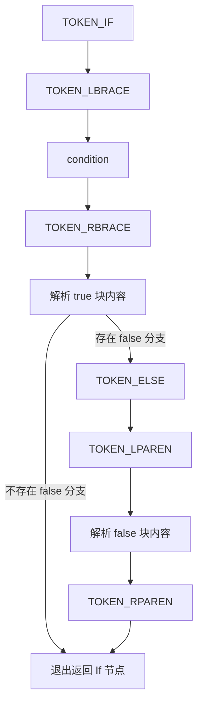

很显然对吗？这就是 `Parser` 的重要性，能将高级语言简略抽象成 AST 抽象语法树。

但这还不够。在 `Parser` 里，每个语法都有自己的解析优先级；如果没有具体的解析顺序，得出来的 AST 节点将杂乱无章。

在 LOICollectionA 的 Parser 中有一套固定的解析顺序。

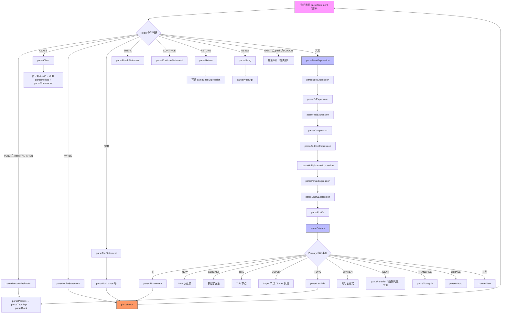

据此，一个完整的 `Parser` 流程就成型了。你可能已经注意到 if 语句出现在 parsePrimary 里——这背后正是『表达式优先语言』与『语句优先语言』最根本的设计分界线。

```cpp
x = if (condition) [ 1 ] : [ 2 ];
```

这里，if 出现在了赋值号右边。在解析器里，赋值右边的解析入口是什么？是 parseBaseExpression()，然后一路往下走到 parsePrimary()。

答案是：if 放在 Primary，是因为它需要作为一个可以产生值的表达式，出现在任何期望表达式的地方——函数调用的参数里、数组元素里、赋值右边、return 后面，甚至嵌套在另一个 if 的条件里。这同时也更贴合 LOICollectionA 的设计理念。

这就是 Lexer 和 Parser 的关键设计。你可能会问：语法对了就行了吗？类型不对怎么办？这正是下一部分 SemanticAnalyzer 要解决的问题。

## 第二部分：深入理解 `SemanticAnalyzer`（`语义分析器`）

`脚本语言` 解析器的变量系统需要什么？类型！正因此类型安全是整个解析器中最关键的部分，写的好能让 AST 中错误的语义提前到编译期内被找出来。所以 `SemanticAnalyzer`（`语义分析器`） 便是整个类型安全的守门员。

这一部分换个读法：先看它声明了什么，再逐个阶段追问它在守什么。

### SemanticAnalyzer 语义分析器

把完整声明一次贴出来，先看全貌：

不是，我好像看到了什么？Σ(っ °Д °;)っ嗯，你等会，让我捋一下。

我决定暂时忽略掉下面这一坨声明，直接跳到 analyze 主流程实现中......你也快点跟上来。

```cpp
class SemanticAnalyzer {
public:
    SemanticAnalyzer(DiagnosticEngine& diag);

    void analyze(ProgramNode& root);

private:
    struct MethodScope {
        std::optional<std::reference_wrapper<ClassNode>> cls;
        std::optional<std::reference_wrapper<MethodDecl>> method;

        [[nodiscard]] bool hasClass() const { return cls.has_value(); }
        [[nodiscard]] bool hasMethod() const { return method.has_value(); }
        [[nodiscard]] ClassNode& classRef() const { return cls->get(); }
        [[nodiscard]] MethodDecl& methodRef() const { return method->get(); }
    };

    struct FieldRef {
        std::reference_wrapper<ClassMember> member;
        std::reference_wrapper<ClassNode> owner;
    };

    struct ConstructorRef {
        std::reference_wrapper<MethodDecl> method;
        std::reference_wrapper<ClassNode> owner;
    };

    struct StaticMethodRef {
        std::reference_wrapper<MethodDecl> method;
        std::reference_wrapper<ClassNode> owner;
    };

    DiagnosticEngine& diagnostics;

    std::vector<std::reference_wrapper<ClassNode>> classes;
    std::vector<std::reference_wrapper<ClassNode>> orderedClasses;
    std::unordered_map<std::string, std::reference_wrapper<ClassNode>> classByName;
    std::unordered_map<std::string, std::vector<std::string>> classMethodOrder;
    std::unordered_map<std::string, std::unordered_map<std::string, int>> classMethodOrdinals;
    std::unordered_map<std::string, std::vector<std::string>> classStaticMethodOrder;
    std::unordered_map<std::string, std::unordered_map<std::string, int>> classStaticMethodOrdinals;
    std::vector<std::reference_wrapper<FunctionDefNode>> functions;
    std::unordered_map<std::string, std::vector<std::reference_wrapper<FunctionDefNode>>> functionsByName;
    std::unordered_map<std::string, TypeInfo> globalTypes;
    std::unordered_map<std::string, TypeInfo> declaredGlobals;
    std::unordered_map<std::string, TypeExpr> aliasExprs;
    std::unordered_map<std::string, SourceLocation> aliasLocs;
    std::unordered_map<std::string, TypeInfo> typeAliases;
    std::unordered_set<std::string> resolvingAliases;
    std::unordered_map<std::string, std::unordered_set<std::string>> constructorAssignedMembers;

    [[nodiscard]] std::optional<std::reference_wrapper<ClassNode>> findClass(const std::string& name) const;

    [[nodiscard]] TypeInfo typeOfValue(const ValueNode::ValueType& value) const;
    [[nodiscard]] TypeInfo typeFromName(const std::string& name, SourceLocation loc, bool reportError) const;
    [[nodiscard]] std::string typeToString(const TypeInfo& type) const;
    [[nodiscard]] bool isNumeric(const TypeInfo& type) const;
    [[nodiscard]] bool isNameDefined(const std::string& name, MethodScope& scope) const;
    [[nodiscard]] bool isAssignableTo(const TypeInfo& target, const TypeInfo& from) const;

    void registerClass(ClassNode& node);
    void collectTypeAliases(ProgramNode& root);
    void resolveDeclaredTypes();
    void resolveHierarchy();
    void buildMethodOrdinals();
    void validateConstructors();
    void validateMemberInitialization();
    void registerFunction(FunctionDefNode& node);
    void checkTopLevel(ProgramNode& root);
    void checkClassBodies();
    void checkFunctionBodies();
    void checkClassBody(ClassNode& cls);
    void checkBody(std::optional<std::reference_wrapper<ClassNode>> cls, MethodDecl& method);

    void checkStatement(ASTNode& node, MethodScope& scope);
    TypeInfo checkExpr(ExprNode& node, MethodScope& scope);
    TypeInfo checkExprImpl(ExprNode& node, MethodScope& scope);
    TypeInfo checkAssignment(AssignmentNode& node, MethodScope& scope);
    TypeInfo checkMemberAccess(MemberAccessNode& node, MethodScope& scope);
    TypeInfo checkMethodCall(MethodCallNode& node, MethodScope& scope);
    TypeInfo checkFuncCall(FuncCallNode& node, MethodScope& scope);
    TypeInfo checkNew(NewNode& node, MethodScope& scope);
    TypeInfo checkSuperCall(SuperCallNode& node, MethodScope& scope);
    TypeInfo checkInstanceOf(InstanceOfNode& node, MethodScope& scope);
    TypeInfo checkReturn(ReturnNode& node, MethodScope& scope);
    TypeInfo checkLambda(LambdaNode& node, MethodScope& scope);

    TypeInfo lookupName(const std::string& name, MethodScope& scope);
    void unify(TypeInfo& target, const TypeInfo& from, SourceLocation loc, const std::string& what);
    TypeInfo resolveTypeExpr(const TypeExpr& expr, SourceLocation loc, bool reportError);

    [[nodiscard]] size_t knownParamCount(const MethodDecl& method) const;
    [[nodiscard]] std::string methodSignature(const MethodDecl& method) const;
    [[nodiscard]] int methodOrdinal(const std::string& className, const std::string& signature) const;
    [[nodiscard]] bool isDerived(const std::string& derivedName, const std::string& baseName) const;
    [[nodiscard]] bool isTypeCompatible(const TypeInfo& target, const TypeInfo& from) const;
    
    [[nodiscard]] std::optional<FieldRef> findField(ClassNode& cls, const std::string& name) const;
    [[nodiscard]] std::optional<FieldRef> findStaticField(ClassNode& cls, const std::string& name) const;
    [[nodiscard]] std::optional<ConstructorRef> findConstructor(ClassNode& cls) const;
    [[nodiscard]] std::optional<StaticMethodRef> findStaticMethod(
        ClassNode& cls, const std::string& name, const std::vector<TypeInfo>& argTypes,
        const MethodScope& scope
    ) const;
    [[nodiscard]] int staticMethodOrdinal(const std::string& className, const std::string& signature) const;
};
```

我将切换大脑风暴模式！╰(￣ω￣ｏ)

先从 analyze 主流程下手，总计两个阶段、九步。

```txt
阶段一：声明收集（顺序无关，支持前向引用）
  1. collectTypeAliases      收集 using 别名
  2. registerClass/Function  符号注册 + 重名检查
  3. resolveHierarchy        类继承拓扑排序（基类在前）+ 循环继承检测
  4. 别名 vs 类名冲突检查
  5. resolveDeclaredTypes    成员/参数/返回值的类型表达式解析
  6. buildMethodOrdinals     构建虚方法 ordinal 表 ← 关键产物

阶段二：检查
  7. checkTopLevel/ClassBodies/FunctionBodies   所有函数体类型检查
  8. validateConstructors    super(...) 义务检查
  9. validateMemberInitialization  成员确定性初始化检查
```

有一点必须拎清：阶段二的顺序不能改变，因为 constructorAssignedMembers 集合是在第 7 步检查构造体内的赋值时顺便收集的，而 8、9 需要的正是它，只有这样才能正常验证。

接下来逐段拆解每一步流程。

### 收集阶段

程序会先从 `collectTypeAliases` 开始，收集所有声明至成员变量 `aliasExprs` 和 `aliasLocs`。之后进入 `registerClass` 和 `registerFunction` 注册类和函数，而在这里关键就是 `classByName` 了。它会收集所有类名，用于在下一次注册类时判断是否重复注册，以及用于解决继承层级问题。

`registerFunction` 为什么没有重名检查？这就是函数重载了，具体我将在下文 `重载解析：最优模型选择` 中揭露这一点，现在继续往下看。

然后看 `resolveHierarchy`，这里有一个小小的细节。在类继承拓扑排序中，如果当前类存在基类，那么它会优先查找基类，并递归为其优先注册，所以 `registerClass` 是必须放在其之前的。如以下示例中对于类重载的定义。

```cpp
class B {}; // 基类 

class A extends B {}; // A 继承基类 B
```

这里在注册类完成后，`classes` 列表内顺序便为 `B、A`：先遇到已添加的 `B`，再撞见 `A` 发现 `extends B`，于是跑去注册 `B`，但会在提前退出处止步，防止重复添加导致乱序。

```cpp
if (visited.contains(cls.name))
    return;
```

它为什么要重复进入注册？这是设计理念的拓展：在这种设计下，下面的语法就是可能的。

```cpp
class A extends B {}; // A 继承基类 B

class B {}; // 基类 
```

这种写法能在一定程度上减轻编码负担。当然也可以依照 C++ 类语法设计理念，调换语义解析顺序，先 `resolveHierarchy`，再 `registerClass`，那样就必须基类先行了。

```cpp
for (const auto& [name, loc] : this->aliasLocs) {
    if (this->classByName.contains(name)) {
        this->diagnostics.addError(loc,
            "Type alias conflicts with class name: " + name);
    }
}
```

这里你发现了吗？没错，`aliasLocs` 出现了！在这里它会检查 `using` 语句是否和类名重复，并提前报告出来。

嗯......接下来有点复杂，我带你一步一步往下看。

`resolveDeclaredTypes` 会先遍历所有类，并检查其的成员变量、成员函数和函数的参数、成员函数和函数的返回值是否有类型表达式等，有的话就进入核心 `resolveTypeExpr` 类型表达式解析获取类型信息。这在 AST 上对应的就是：

```cpp
struct ClassMember {
    // loc, name ...

    bool hasDefault = false;
    std::unique_ptr<ExprNode> defaultExpr;
    TypeInfo type;

    TypeExpr typeExpr;
    bool hasTypeExpr = false;
};

struct MethodDecl {
    // loc, name 

    TypeExpr returnTypeExpr;
    TypeInfo returnType;
    bool hasReturnType = false;
    
    // isConstructor, isPrivate, isStatic, body

    std::vector<MethodParam> params;
    std::vector<TypeInfo> paramTypes;

    // hasReturnStatement, hasSuperCall
};
```

我对其进行了简单的简化，你应该能看出每一块都是各自独立的一部分。在 `Parser` 里对于以下语句：

```cpp
// 在 class A 中
a: int = 1 // ": int" 启用 hasTypeExpr，"= 1" 启用 hasDefault
```

就会启用 `hasDefault`、`hasTypeExpr`，而在将会使 `SemanticAnalyzer` 发挥出它的第一个作用。

当成员变量的类型是明确的时（即存在右值），它会通过 `checkExpr` 核心检查，获取右值类型并进入 `unify` 检查左值类型是否与右值不一致。这样成员变量的类型安全就得到了保证。

成员函数和普通函数同理：参数与返回值不会出现类型冲突，因此这一层不需要类型检查。

说到这里你可能好奇：`resolveTypeExpr` 和 `checkExpr` 只是用于获取和检查吗？不是的，它们各自都有自己的设计巧思。先从 `resolveTypeExpr` 下手。

```cpp
TypeInfo SemanticAnalyzer::resolveTypeExpr(const TypeExpr& expr, SourceLocation loc, bool reportError) {
    if (expr.name == "variant") {
        if (expr.args.size() < 2) {
            if (reportError)
                this->diagnostics.addError(loc, "variant requires at least two type arguments");
            return {};
        }

        TypeInfo result;
        result.kind = TypeKind::Variant;
        result.variantOptions.reserve(expr.args.size());
        for (const auto& arg : expr.args)
            result.variantOptions.push_back(this->resolveTypeExpr(arg, loc, reportError));

        return result;
    }

    // ...
}
```

你看到了吗？它内部存在一个 `variant` 类型，它强制要求类型参数必须有两个以上，并递归判断内部类型，这样就使 `variant<variant<...` 这种类型是可行的。继续......

```cpp
TypeInfo SemanticAnalyzer::resolveTypeExpr(const TypeExpr& expr, SourceLocation loc, bool reportError) {
    // ...

    if (expr.name == "optional") {
        if (expr.args.size() != 1) {
            if (reportError)
                this->diagnostics.addError(loc, "optional requires exactly one type argument");
            return {};
        }

        TypeInfo inner = this->resolveTypeExpr(expr.args[0], loc, reportError);
        if (inner.kind == TypeKind::Optional) {
            if (reportError)
                this->diagnostics.addError(loc, "optional cannot be nested inside optional");
            return {};
        }

        TypeInfo result;
        result.kind = TypeKind::Optional;
        result.optionalInner = std::make_shared<TypeInfo>(inner);
        return result;
    }

    // ...
}
```

只需要看这一句。

```cpp
if (inner.kind == TypeKind::Optional) {
    /// ...
}
```

这说明在 `optional` 类型中，是不支持 `optional<optional<...` 这类语法，它会在语义分析中就被报出来，而不是随着 AST 进入到 `Compiler` 中。最后：

```cpp
TypeInfo SemanticAnalyzer::resolveTypeExpr(const TypeExpr& expr, SourceLocation loc, bool reportError) {
    // ...

    auto aliasIt = this->aliasExprs.find(expr.name);
    if (aliasIt != this->aliasExprs.end()) {
        if (auto resolvedIt = this->typeAliases.find(expr.name);
            resolvedIt != this->typeAliases.end()) {
            return resolvedIt->second;
        }

        if (!this->resolvingAliases.insert(expr.name).second) {
            if (reportError)
                this->diagnostics.addError(loc,
                    "Circular type alias involving '" + expr.name + "'");
            return {};
        }

        TypeInfo resolved = this->resolveTypeExpr(aliasIt->second, loc, reportError);
        this->resolvingAliases.erase(expr.name);
        this->typeAliases[expr.name] = resolved;
        return resolved;
    }

    return this->typeFromName(expr.name, loc, reportError);
}
```

看！`aliasExprs` 又出现了，这里是在解析 using 的原类型并与之对应。

再看 `buildMethodOrdinals`，其实它的原理很简易，但正是有 `orderedClasses` 的存在这就使其能以小的体量，作为整个语义分析器中关键产物的中心。

首先它会遍历 `orderedClasses` 并依据类内部成员函数的参数，通过 `methodSignature` 构建独立签名，并向 `classXXXOrder` 和 `classXXXOrdinals` 添加签名与签名所在的索引。同时因为基类先行理念，它在判断类存在基类时会获取该类的 Order 产物，作为自己的构建产物的基础。

这样整个收集阶段就结束了，到这里你可能头会有点被绕晕，但没事这是正常的。我将给你一个具体的流程图以便你理解。

总的来说，收集阶段的核心目标是**构建符号表、解析类型、建立继承拓扑**，并为后续的虚方法调用生成 `ordinal` 表。

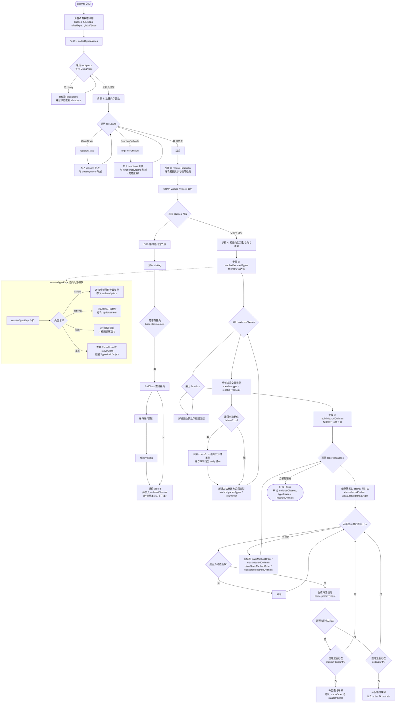

---

流程关键点补充说明

| 步骤 | 核心方法 | 关键产物 / 副作用 |
| :--- | :--- | :--- |
| **1. collectTypeAliases** | `collectTypeAliases` | 构建 `aliasExprs`（别名→类型表达式映射），并检测**保留关键字**和**重复定义**。 |
| **2. registerClass/Function** | `registerClass`、`registerFunction` | 构建 `classByName`（支持前向引用）、`functionsByName`（支持重载），并检测类名重复与成员变量重复。 |
| **3. resolveHierarchy** | `resolveHierarchy` | 通过 DFS 拓扑排序生成 `orderedClasses`（基类在子类之前），同时检测**循环继承**。 |
| **4. 冲突检查** | `analyze` 中的内联循环 | 检查类型别名是否与已注册的类名冲突（禁止别名覆盖类名）。 |
| **5. resolveDeclaredTypes** | `resolveDeclaredTypes` | **递归展开** `variant`/`optional` 泛型参数和用户自定义 `using` 别名；同时触发默认值表达式类型推断（`checkExpr`）。 |
| **6. buildMethodOrdinals** | `buildMethodOrdinals` | 为每个类（含基类继承）生成实例方法和静态方法的**签名→序号**映射，用于后续虚调用（`methodOrdinal`）和多态分发。 |

### 检查阶段

这一阶段是针对上一阶段收集的生成实例方法和静态方法的**签名→序号**映射，深入检查每一个语句是否符合语义预期。

具体可以为：

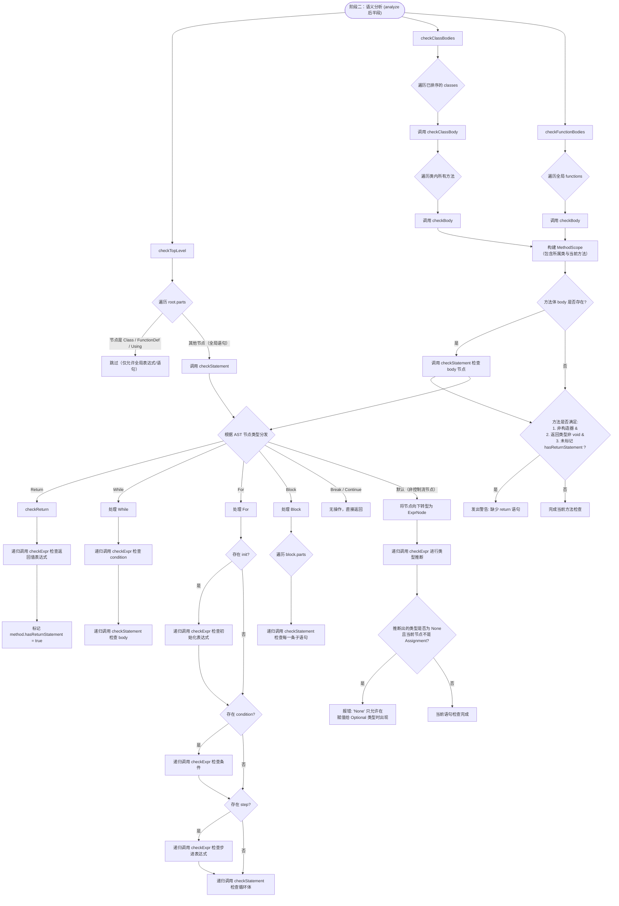

简单来说 `checkTopLevel`、`checkClassBodies`、`checkFunctionBodies` 这三步共同完成了对整个程序**所有可执行代码块**的语义检查，具体分工如下：

1. **`checkTopLevel`**：跳过类、函数和Using声明，专门对**全局作用域**中剩余的顶级表达式/语句（如全局赋值）进行类型检查和合法性验证。
2. **`checkClassBodies`**：遍历所有已注册的类，对其内部定义的**每一个方法**（构造、实例、静态）构建作用域并递归检查方法体。
3. **`checkFunctionBodies`**：遍历所有已注册的全局函数，对其**函数体**执行同样的递归语义检查（包括返回语句缺失告警）。

**概括来说**：这本质上是**从全局到类内、从声明到定义，遍历所有可执行代码（函数体/方法体/全局语句），递归进行类型推断与逻辑校验**。

但注意 checkStatement 的 Block 分支进行递归调用 checkStatement 检查每一条子语句，这实际上形成了一个语法树的自顶向下遍历，与 checkExpr 的自底向上类型推断形成互补。

你可能会有个疑问：`checkExpr` 到底是什么？接下来我会给出它的具体流程图：

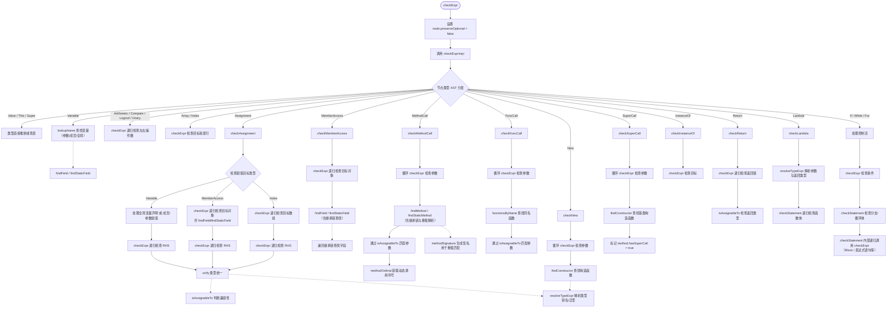

核心逻辑是 **`checkExpr` → `checkExprImpl` → 根据 AST 节点类型分发到具体的检查函数**，这些函数在处理子表达式时会**递归回调 `checkExpr`**，或通过 `checkStatement` 处理代码块。

另外 `optional` 和 `variant` 除了类型语法外，还有三个由语义分析器特判的"成员"——它们不是普通字段，而是**关键词**。`checkMemberAccess` 看到它们时，会把节点标记成对应的 `MemberKind`，编译器再据此发射专用指令：

| 关键词 | 可用类型 | 语义 |
| :--- | :--- | :--- |
| `.type` | `optional<T>` / `variant<...>` | 返回当前存储类型的名称（`string`） |
| `.value` | `optional<T>` / `variant<...>` | 取出内部值；Optional 为空时在运行期报错 |
| `.has_value` | 仅 `optional<T>` | 返回是否有值（`bool`） |

对应的检查逻辑很直白：

```cpp
if (targetType.kind == TypeKind::Variant || targetType.kind == TypeKind::Optional) {
    if (node.memberName == "type") {
        node.memberKind = MemberAccessNode::MemberKind::TypeOf;
        return { TypeKind::String };
    }

    if (node.memberName == "value") {
        node.memberKind = MemberAccessNode::MemberKind::Value;

        if (targetType.kind == TypeKind::Optional)
            return *targetType.optionalInner;
        // variant 只在所有成员类型一致时，.value 才有确定的静态类型
    }

    if (node.memberName == "has_value") {
        if (targetType.kind != TypeKind::Optional)
            diagnostics.addError(node.loc, "'.has_value' is only available on optional values");
        node.memberKind = MemberAccessNode::MemberKind::HasValue;
        return { TypeKind::Bool };
    }
}
```

几个值得注意的点：

- `.type` / `.value` / `.has_value` 都会保留 Optional 本身（`preserveOptional = true`），避免被自动解包；
- `.value` 在 Optional 上等价于一次显式解包，空 Optional 的错误会留到运行期报告（编译器只负责类型，不负责值）；
- 这三个关键词对应 `TYPE_OF` / `UNWRAP` / `HAS_VALUE` 指令，第四部分的优化器会对它们做常量折叠（空 Optional 的 `UNWRAP` 除外）。

走完 全代码 语义检查，接下来就是 `validateConstructors`。它检查派生类构造器是否调用了 `super(...)`：

```cpp
class Base {
public:
    x = 0;
    Base(v: int) { this.x = v; }
} 

class Child extends Base {
    Child(v: int) { super(v); } // 这无法通过 validateConstructors 的，因为 Base 的构造函数有参数
}

class BaseA {
public:
    x = 0;
    Base() { this.x = 1; }
} 

class Child extends BaseA {
    Child(v: int) { } // 这可以通过 validateConstructors 的，因为 Base 的构造函数没有参数
}
```

而 `validateMemberInitialization` 就是依据 `constructorAssignedMembers` 验证没有默认值的成员变量是否在构造函数里赋值过。

至此，整个语义分析器完成了类型检查与自动推导，但还有一点你应该记得：前文说到的 `重载解析：最优模型选择`。接下来进入重载模型的海洋。

### 重载解析：最优模型选择

```cpp
func id(x: int) -> int { return x; }
func id(x: string) -> string { return x; }

id(7);      // 命中 int 版本
id("s");    // 命中 string 版本
```

这两个函数都叫 `id`，调用 `id(7)` 时，语义分析器为什么知道该选 int 版本而不是 string 版本？重载解析要处理的就是这件事：**从一堆同名候选里，找出唯一一个"应该被调用"的。**

它分两步走：先收集候选，再给候选打分。

**候选是怎么收集的？**

全局函数登记在 `functionsByName`（名字 → 函数列表）里。分析器拿到 `id(7)` 后，先按名字找到 `id` 的列表，再逐个检查参数个数和类型，能通过的才进 `candidates`：

```cpp
std::vector<size_t> candidates;
for (size_t i = 0; i < it->second.size(); ++i) {
    const auto& decl = it->second[i].get().decl;
    if (decl.params.size() != argCount)
        continue; // 参数个数不同，直接淘汰

    bool match = true;
    for (size_t j = 0; j < argCount; ++j) {
        const TypeInfo& param = decl.paramTypes[j];
        if (!this->isAssignableTo(param, argTypes[j])) {
            match = false;
            break;
        }
    }

    if (match)
        candidates.push_back(i);
}
```

注意这里用的是 `isAssignableTo`，不是"类型必须相等"。它的宽容程度决定了哪些调用合法：

| 目标类型 | 来源类型 | 结果 |
| :--- | :--- | :--- |
| `Optional<T>` | `T` | 自动装箱 |
| `Optional<T>` | `None` | 允许，这是 `None` 唯一能去的地方 |
| `Optional<T>` | `Optional<T>` | 解内层继续比较 |
| `Variant<...>` | 任一成员类型 | 命中一个成员即可 |
| 基类 `B` | 派生类 `D` | 子类对象可以当父类用 |
| 任意 | `Unknown` / `Void` | 直接放行 |

最后一行是特意留的活口：重载解析发生时，类型推断还没有全部结束，实参类型偶尔还是 `Unknown`。如果在这里一票否决，后续更精确的类型检查反而看不到真正的错误。先放行，把判断留给后面——这也是"尽量多收集错误"原则在重载上的体现。

**候选有好几个，怎么定胜负？**

打分。全局函数的评分标准只有一条：**已知类型的参数越多，越具体，越优先。**

```cpp
size_t SemanticAnalyzer::knownParamCount(const MethodDecl& method) const {
    size_t count = 0;
    for (const auto& type : method.paramTypes) {
        if (type.kind != TypeKind::Unknown)
            count++;
    }
    return count;
}
```

分数高者胜：

```cpp
size_t best = candidates[0];
size_t bestScore = knownParamCount(it->second[best].get().decl);
for (size_t i = 1; i < candidates.size(); ++i) {
    size_t score = knownParamCount(it->second[candidates[i]].get().decl);
    if (score > bestScore) {
        best = candidates[i];
        bestScore = score;
    }
}
```

规则背后的直觉很朴素：形参全部写了类型的函数很"挑剔"，参数全是 `Unknown` 的函数什么都接。两者都能匹配时，挑剔的那个更符合调用者的意图。分数相同就取先声明者。整套规则是确定的——同样的代码编译多少次，选中的都是同一个函数，不会出现"歧义报错"。

如果候选一个都没有，分析器会报：

```txt
No matching function 'id' with 1 argument(s)
```

参数个数不对和类型不匹配，最终都汇成这一条错误。坦白说，这是分析器偷懒：它只关心"有没有匹配"，不关心"为什么没匹配"。

实例方法比函数多了一条规则：**继承深度**。调用 `a.f(...)` 时，分析器从 `a` 的静态类型出发，沿继承链一层层收集同名方法，先比声明类离调用类型有多远：

```cpp
int depth = depthOf(candidates[i].first.get());   // 声明类离调用类型有多远
size_t score = knownParamCount(candidates[i].second.get());

if (depth < bestDepth || (depth == bestDepth && score > bestScore)) {
    best = candidates[i];
    bestDepth = depth;
    bestScore = score;
}
```

`Child` 里定义了 `f`，就轮不到 `Base` 里的 `f` 来抢；一样近，再比具体度。静态方法的流程完全相同，只是候选只收 `isStatic`，这里不再重复。

**选完了，然后呢？**

分析器要把"选了谁"写进 AST，编译器才能生成对应的调用。它记录的是 `ordinal`（序号）：

- 全局函数：`functionOrdinal` 是候选在 `functionsByName[name]` 里的下标，编译器据此查 `functionIndices[name]` 并发射 `CALL_FUNC`；
- 实例方法：`methodOrdinal` 是方法签名在类方法表里的序号。阶段一的 `buildMethodOrdinals` 保证同一签名在继承链上序号一致，所以运行时只要拿序号查**实际对象**的方法表，就能分派到正确的实现——`CALL_METHOD_VIRTUAL` 的多态就是这么来的；
- `super` 调用是例外：它明确要调基类版本，直接 `CALL_METHOD`，不走虚分派。

整条链路就是：候选收集 → 打分 → 写 ordinal → Compiler 查表 → VM 分发。

最后补三个容易踩的坑。

一是**构造函数不参与重载**。Parser 在语法层面就禁止重复构造器，`findConstructor` 也只是沿继承链找第一个构造器，从不比较参数。所以构造器不存在"选最优"的问题，参数不符直接报错。

二是**原生类不走这套评分**。`CustomForm`、`ObservableString` 这些类由 C++ 侧注册签名，分析器用 `matchesNativeSignature` 逐一比对，对象参数只要求"是对象"就算过。原生世界的规则由原生侧定义，脚本侧不越权。

三是`private`**方法在收集阶段就被排除**，根本进不了候选列表。所以在类外调用私有方法，得到的错误和调用不存在的方法一模一样："No matching method"。权限检查被折叠进了候选收集。

回到开头的 `id(7)`：它命中 int 版本，不是因为"看起来应该"，而是因为候选筛完只剩一个——名字对、个数对、类型也接得住。重载解析听起来唬人，拆开其实就是一次先过滤、再打分的选拔。ヽ(●´∀`●)ﾉ

这就是为什么 `SemanticAnalyzer`（`语义分析器`） 是类型安全的守门员，它负责检查整个 AST 的类型安全以及函数重载匹配的选择。现在休息一下，喝杯水、出去走走，看看世界，我在这里等你继续下一部分。o(￣▽￣)ｄ

---

## 第三部分：理解 `Compiler`（`编译器`），以及为什么选择 `访问者模式` 而不是 `模式匹配`

第三部分换个视角：从一棵树说起。

在编译器眼里，`1 + 2 * 3` 不是一行算式，而是一棵树：

```txt
    +
   / \
  1   *
     / \
    2   3
```

但虚拟机只认线性的指令，于是 `Compiler` 的工作只剩一件：把这棵树压扁成指令序列，同时保证压扁之后，算出来的结果和原来一模一样。

整个流水线你已经见过了：

```txt
Lexer → Parser → SemanticAnalyzer → Compiler → Optimizer → VM
```

前两部分把文本变成了带类型信息的 AST，现在轮到 Compiler 把这棵树变成 `BytecodeChunk`（字节码块）。先看它的入口。

### 编译入口：先登记，再编译

```cpp
BytecodeChunk Compiler::compile(ASTNode& root) {
    // 预扫描：先数清楚一共有多少个方法体，一次性把内存留够
    this->chunk.methodBodies.reserve(countMethodBodies(root));

    if (root.getType() == ASTNode::Type::Program) {
        auto& program = static_cast<ProgramNode&>(root);

        // 第一遍：注册类与函数的元数据
        for (auto& part : program.parts) {
            switch (part->getType()) {
                case ASTNode::Type::Class:
                    this->registerClassMeta(static_cast<ClassNode&>(*part));
                    break;
                case ASTNode::Type::FunctionDef:
                    this->registerFunctionMeta(static_cast<FunctionDefNode&>(*part));
                    break;
                default:
                    break;
            }
        }

        // 第二遍：编译所有方法体
        for (auto node : this->bodyOrder) {
            ASTNode& current = node.get();
            switch (current.getType()) {
                case ASTNode::Type::Class:
                    this->compileClassBodies(static_cast<ClassNode&>(current));
                    break;
                case ASTNode::Type::FunctionDef:
                    this->compileFunctionBody(static_cast<FunctionDefNode&>(current));
                    break;
                default:
                    break;
            }
        }

        // 第三遍：编译顶层表达式（省略：中间语句后补 POP，结尾发射 HALT）
    }

    this->current.get().emit(OpCode::HALT);
    return std::move(chunk);
}
```

严格来说，在注册之前还有一个不起眼的循环：先把所有类名登记进 `classNodes`。这样 `registerClassMeta` 处理继承时，即使基类声明在子类后面，也能向前找到它。

`countMethodBodies` 也值得一提，它本身就是一个 `ASTVisitor`，叫 `MethodBodyCounter`，专门负责遍历 AST 数一数有多少个方法体。你注意到没有——编译器的第一个动作，就已经是"让一个 visitor 去逛一遍树"。

### 访问者模式：为什么不是模式匹配

你可能已经发现了，上面这段入口代码里出现了 `switch`。既然编译器都叫"访问者"了，为什么还要用 switch？

因为这里的 switch 只处理**顶层**的几种节点，是一个很小的局部决策。真正遍历整棵树的，是另一套机制。每个 AST 节点都实现了 `accept`：

```cpp
struct ArithmeticNode : ExprNode {
    // ...

    void accept(ASTVisitor& visitor) override {
        visitor.visit(*this);
    }
};
```

`ASTVisitor` 则对每一种节点声明一个纯虚函数：

```cpp
class ASTVisitor {
public:
    virtual void visit(ValueNode& node) = 0;
    virtual void visit(VariableNode& node) = 0;
    virtual void visit(ArithmeticNode& node) = 0;
    // ... 一共 30 种节点，一个不漏
};
```

注意这里的巧妙之处：`accept` 的参数是 `ASTVisitor&`（基类引用），但调用 `visitor.visit(*this)` 时，`*this` 已经是具体的节点类型了。于是 `accept` 负责回答"我是谁"，`visit` 负责"针对我干活"——这就是双重分派。调用方从头到尾只需要一句 `node.accept(visitor)`，剩下的路由全部由虚函数完成。

Compiler 自己就是一个 `ASTVisitor`，每种节点怎么编译，就写在对应的 `visit` 里：

```cpp
void Compiler::visit(ArithmeticNode& node) {
    this->compileValue(*node.left, node.loc);
    this->compileValue(*node.right, node.loc);

    if (node.op == "+") this->current.get().emit(OpCode::ADD, 0, node.loc);
    else if (node.op == "-") this->current.get().emit(OpCode::SUB, 0, node.loc);
    // ... MUL / DIV / MOD / POW
}
```

那么不用访问者模式行不行？行，SemanticAnalyzer 就是反例——`checkExprImpl` 里一个 `switch (node.getType())`，每个 case 手动 `static_cast`：

```cpp
TypeInfo SemanticAnalyzer::checkExprImpl(ExprNode& node, MethodScope& scope) {
    switch (node.getType()) {
        case ASTNode::Type::Arithmetic: {
            auto& arith = static_cast<ArithmeticNode&>(node);
            TypeInfo left = checkExpr(*arith.left, scope);
            TypeInfo right = checkExpr(*arith.right, scope);
            // ...
        }
        // 每新增一种节点，都要记得来这里补一个 case
    }
}
```

那为什么 Compiler 不沿用这个思路？因为 C++ 没有真正的模式匹配。`std::visit` 只能用在 `std::variant` 上，而原有的 AST 是继承体系加 `unique_ptr`，天生没有 `std::visit` 可用；手写 `switch + static_cast` 虽然能跑，但有两个硬伤：

1. **漏一个 case 没有任何提示**。新增一种节点时，所有 switch 都要手动补分支，忘掉哪一个都不会报错，直到某天真的跑到那里才发现。
2. **每加一个 pass 就要复制一套 switch**。编译器不止一个遍历者——入口处那个 `MethodBodyCounter` 也是 `ASTVisitor`。如果大家都写 switch，每加一个 pass 就要把全节点分发重写一遍。

访问者模式把这两个问题都解决了：新增 pass 只需要新写一个继承 `ASTVisitor` 的类，AST 节点一行都不用改；新增节点类型时，所有 visitor 的纯虚 `visit` 会同时变成编译期错误，编译器直接逼你补全。

当然，访问者模式也不是免费的。每个节点都要写一遍 `accept`，每个 visitor 都要实现几十个 `visit`，样板代码确实不少。所以 SemanticAnalyzer 用 switch 也合理：它只有 `checkStatement` / `checkExprImpl` 两个分发点，switch 反而更直白。**模式匹配适合"类型少、操作多"的穷举，visitor 适合"pass 多、可扩展"的编译器**——两种手段在 LOICollectionA 里并存，各管各的。

### 一个表达式的编译：从树到指令

编译表达式的核心是 `compileValue`：

```cpp
void Compiler::compileValue(ExprNode& node, const SourceLocation& loc) {
    node.accept(*this);

    if (node.type.kind == TypeKind::Optional && !node.preserveOptional)
        this->current.get().emit(OpCode::UNWRAP, 0, loc);
}
```

先让节点自己决定怎么编译（`accept`），再根据语义分析阶段留下的类型信息补一个 `UNWRAP`——Optional 值在非保留场景下会被自动解包。类型信息从哪来？还记得第二部分吗，`checkExpr` 会把推断出的类型写回 `node.type`。

`ValueNode` 的编译最简单：把字面量丢进常量池，再发射对应的 PUSH 指令：

```cpp
void Compiler::visit(ValueNode& node) {
    int idx = this->addConstant(node.value);
    switch (node.value.index()) {
        case 0: current.get().emit(OpCode::PUSH_INT, idx, node.loc); break;
        case 1: current.get().emit(OpCode::PUSH_FLOAT, idx, node.loc); break;
        case 2: current.get().emit(OpCode::PUSH_STR, idx, node.loc); break;
        case 3: current.get().emit(OpCode::PUSH_BOOL, idx, node.loc); break;
        // ...
    }
}
```

回到开头的 `1 + 2 * 3`。Parser 的优先级规则已经保证了 AST 是 `1 + (2 * 3)`，编译采用后序遍历：先左子树，再右子树，最后发射运算符。所以压扁后的指令长这样：

```txt
PUSH_INT 1     // 常量池 [0] = 1
PUSH_INT 2     // 常量池 [1] = 2
PUSH_INT 3     // 常量池 [2] = 3
MUL            // 弹出 2、3，压入 6
ADD            // 弹出 1、6，压入 7
```

每一层树结构都变成了栈上的一进一出。树的形状没了，但求值顺序一点没丢。

### 控制流：跳转占位与回填

树转指令最麻烦的不是表达式，而是控制流。`if`、`while` 都要跳转，可编译到一半，跳转目标地址根本还不存在。LOICollectionA 的处理方式是：**先发射一条 operand 为 0 的占位跳转，等目标位置确定后再回来 patch**。

以 `WhileNode` 为例：

```cpp
void Compiler::visit(WhileNode& node) {
    size_t loopStart = this->current.get().currentIP();

    this->compileValue(*node.condition, node.loc);
    size_t jmpFalseIdx = this->current.get().emit(OpCode::JMP_IF_FALSE, 0, node.loc); // 占位

    this->loopStack.push_back(LoopContext{});
    this->loopStack.back().continueTarget = loopStart;

    node.body->accept(*this);
    this->current.get().emit(OpCode::POP, 0, node.loc);

    size_t jmpBackIdx = this->current.get().emit(OpCode::JMP, 0, node.loc);
    this->current.get().patchJump(jmpBackIdx, /* 回到 loopStart */);

    size_t exitPos = this->current.get().currentIP();
    this->current.get().patchJump(jmpFalseIdx, /* 条件为假时跳到 exitPos */);

    for (size_t idx : this->loopStack.back().breakJumps)
        this->current.get().patchJump(idx, /* 跳到 exitPos */);
    for (size_t idx : this->loopStack.back().continueJumps)
        this->current.get().patchJump(idx, /* 跳到 loopStart */);

    this->loopStack.pop_back();
}
```

`loopStack` 是编译器维护的一个栈：遇到循环就压入一个 `LoopContext`，里面收集这个循环体内的 `break` / `continue` 跳转位置。`break` 和 `continue` 的 `visit` 只是往当前上下文里记一笔，等循环编译完，所有跳转统一回填。这样嵌套循环也不会乱——每个 `break` 永远只属于栈顶那个循环。

### 类、方法与调用的元数据

方法体和顶层表达式会编译成指令，但类本身还需要一份"说明书"，这就是 `ClassMeta`。它记录字段名、默认值、构造器下标、方法序号表，还有祖先链：

```cpp
ir::ClassMeta meta;
meta.name = node.name;
meta.baseClassIndex = baseIdx;

if (baseIdx >= 0) {
    const auto& base = this->chunk.classes[baseIdx];
    meta.fieldNames = base.fieldNames;          // 继承基类字段布局
    meta.methods = base.methods;                 // 继承基类方法序号表
    meta.methodSignatures = base.methodSignatures;
    // ...
    meta.ancestorIndices.push_back(baseIdx);     // 记录祖先链，供 INSTANCEOF
}
```

还记得第二部分的重载解析吗？它选出的 `ordinal`，在这里变成真正的调用指令：

- 全局函数：`functionOrdinal` 查 `functionIndices` → `CALL_FUNC`；
- 实例方法：`methodOrdinal` → `CALL_METHOD_VIRTUAL`，运行时按实际对象分派；`super` 则直接 `CALL_METHOD`，不走虚分派；
- 原生类：`CALL_NATIVE_METHOD`，类名、方法名、参数个数统一收进 `nativeCalls` 表并去重；
- λ：每个 λ 体是独立的 `BytecodeChunk`，`MAKE_LAMBDA` 生成闭包对象，调用时走 `CALL_LAMBDA`。

### 字节码产物：BytecodeChunk

编译的最终产物是一个 `BytecodeChunk`。它不是一个扁平的指令数组，而是一张"目录 + 正文"结构的表：

| 字段 | 用途 |
| :--- | :--- |
| `code` | 指令序列，每条是 `Instruction{ op, operand, loc }` |
| `constants` | 常量池，`PUSH_*` 通过下标引用 |
| `classes` / `methods` | 类与全局函数的元数据 |
| `methodBodies` | 每个函数/方法/λ 的独立字节码块 |
| `nativeCalls` / `virtualCalls` / `superCalls` | 各类调用的元数据，VM 运行时查表 |
| `emit` / `patchJump` | 发射指令、回填跳转的核心工具 |

注意 `Instruction` 里带着 `SourceLocation`——每一条指令都知道自己来自源码的哪一行。这意味着运行时出错的报错信息可以精确到脚本的原始位置，而不是一句抽象的"执行失败"。

回到最初的问题：为什么编译器选访问者模式而不是模式匹配？因为 C++ 没有真正的模式匹配可用，而 `switch + static_cast` 在节点多、pass 多的编译器里，维护成本会随着新增节点线性上涨。访问者模式把"新增 pass"的成本降到最低，把"新增节点"的遗漏变成编译期错误——这笔账对编译器是划算的。至于它产出的 `BytecodeChunk` 会被 Optimizer 怎么折腾、VM 又是怎么执行的，那就是接下来的事了。

---

## 第四部分：明晰 `Optimizer`（`优化器`）的运行逻辑，以及为什么它是编程语言中最必不可少的部分

第三部分结尾我留了个尾巴：`BytecodeChunk` 会被 Optimizer 折腾。现在把它拆开：怎么折腾，以及为什么折腾得这么小心。

先看一个最简单的例子。`1 + 2 * 3` 经编译器压扁后是六条指令：

```txt
PUSH_INT 1
PUSH_INT 2
PUSH_INT 3
MUL
ADD
HALT
```

但经过 Optimizer 之后，它变成了两条：

```txt
PUSH_INT 7
HALT
```

乘法和加法都没了，VM 连"算"都不用算。这就是**常量折叠**（constant folding）：编译期能算出来的，绝不留到运行期。

那优化器是怎么知道 `2 * 3` 一定等于 6 的？

### 优化器是一个"栈模拟器"

Optimizer 不会重新解析 AST，它直接对着字节码做文章。办法很朴素：**把 VM 的执行过程在编译期重演一遍**。它维护一个虚拟栈，栈里的每一项要么是"未知"，要么是一个 `TrackedValue`：

```cpp
struct TrackedValue {
    ValueNode::ValueType value;   // 我确信这个值是什么
    int producer = -1;            // 它是哪条指令产生的
    bool removable = false;       // 能否安全地把那条指令删掉
};
```

每读一条指令，优化器就在这个虚拟栈上模拟它的效果：

- 遇到 `PUSH_INT 2`，压入 `TrackedValue{2, 这条指令, true}`；
- 遇到 `ADD`，弹出左右两个操作数——如果两边都是已知常量，就当场算出结果，再压入一个新常量；
- 如果栈顶是"未知"，就老老实实把指令原样保留。

关键在这里：算结果用的是 **VM 自己的函数**。

```cpp
DiagnosticEngine foldDiag;
ValueNode::ValueType result = VM::applyArithmetic(
    knownValue(left).value, knownValue(right).value, arithmeticOpName(instr.op), foldDiag);
```

优化器和虚拟机共用同一套算术、比较、类型判断逻辑，折叠结果和运行时结果因此必然一致。这不是"优化器自己发明了一套规则"，而是"把运行期要做的事提前做了"。

### 能证明的才折叠，证明不了的保留

虚拟栈模拟要成立，有一个前提：**每个被折叠的值都必须是"可移除"的**。`removable` 就是干这个的：

- 一条 `PUSH` 指令如果被某个跳转指到了，它就不能删——因为别的路径可能也会用到它；
- 被 `DUP` 复制过的值同样不能删；
- 只有"由我独家产生、只被我一个人消费"的常量，才有资格被折叠掉。

这条规则之外，还有一个更微妙的边界：**会报错的运算不能折叠**。比如 `10.0 % 3.0`：

```txt
PUSH_FLOAT 10.0
PUSH_FLOAT 3.0
MOD
```

`applyArithmetic` 会往 `foldDiag` 里写一条错误。一旦发现折叠会产生运行期错误，优化器立刻收手，把三条指令原样保留——让错误在运行期照常发生，而且带着准确的源码位置。空 Optional 的 `UNWRAP` 同理：`b: optional<string> = None; b` 里的解包指令不会被折叠成"空值"，因为解包空 Optional 是一个必须报错的运行期行为。

这其实是整个优化器最重要的原则：**优化只能改变"怎么算"，不能改变"算什么"**。程序该报的错，一个都不能少。

### 不只是折叠：条件消除与死代码

常量折叠只是第一步。`JMP_IF_FALSE` / `JMP_IF_TRUE` 遇到已知常量条件时，优化器能直接判断这个跳转是否永远成立：

- `if (true) [1 : 2]`：条件恒真，条件跳转被改写成无条件跳转，false 分支变成不可达代码，随后被删掉；
- `if (false) [1 : 2]`：条件跳转整个消失，true 分支同样不可达；
- `while (false) [ ... ]`：循环体里的指令全部不可达，被整体移除。

这些靠的是优化器最后的收尾阶段：它把所有跳转目标重新映射到折叠后的指令，然后从第 0 条指令出发做一次可达性遍历，凡是走不到的指令全部删除，顺带把"跳到下一条指令"的无意义跳转也去掉。`while (true) [ ... break ... ]` 会被正确保留——优化器认得那是循环的向后跳转目标，不会把还有 `break` 逃生的循环体当成死代码。

### 它折叠什么

| 类别 | 例子 | 说明 |
| :--- | :--- | :--- |
| 算术 / 比较 / 逻辑 | `1 + 2 * 3`、`true && true` | 用 VM 函数折叠，出错则不折 |
| 一元运算 | `!true`、`-x` | 同上 |
| 类型内省 | Optional 的 `.type` / `.has_value` | 直接算成字符串 / 布尔值 |
| 数组 | `[1, 2, 3][1]` | 字面量数组 + 常量下标可折叠，元素本身是数组时不折 |
| 条件跳转 | `if (true) [...]`、`while (false) [...]` | 常量条件消除 + 不可达代码删除 |
| 不折叠 | `10.0 % 3.0`、空 Optional 的 `UNWRAP` | 折叠会吞掉运行期错误，必须保留 |

顺带一提，优化器会统计自己的工作成果：`Stats` 里 `folded` 记录折叠次数，`removed` 记录删除条数。测试里也经常直接断言这两个数字，比如 `1 + 2 * 3` 折叠后只剩 `PUSH_INT 7` 和 `HALT`。

### 为什么它是"最必不可少"的部分

前面几部分里，Lexer、Parser、SemanticAnalyzer、Compiler 保证的都是同一件事：**程序能被正确地翻译**。但"正确"和"好用"之间还差着一大截。没有优化器，`1 + 2 * 3` 每次运行都要真的做一次乘法和加法；没有优化器，`while (false)` 的循环体会被 VM 一遍遍检查条件后才跳过——不是错，是浪费。

优化器把这些浪费提前到编译期处理掉，同时用"共用 VM 语义"和"错误不可折叠"两条铁律保证行为不变。对一个跑在 Minecraft 服务器上的脚本语言来说，这一点尤其重要：脚本写得越自由，越需要有人替你把"自由"里那些重复劳动清掉。

### 优化流程一览

整个优化器的流程可以用一张图串起来：

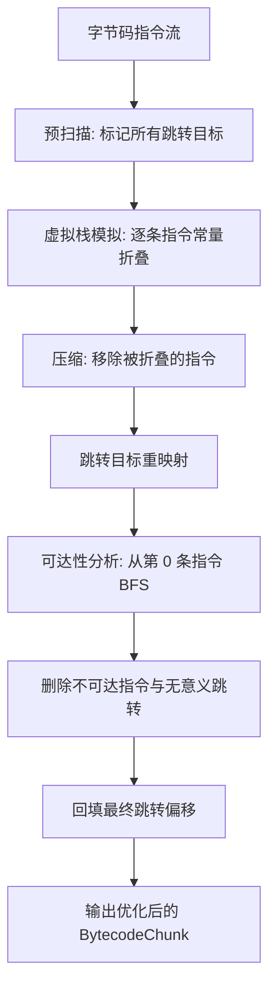

但其实它在 LOICollectionA 的 lcui 编译期中没做什么，没有常量传播穿透变量，也没有公共子表达式消除、强度削减、分支反转，更不迭代到不动点，深度优化。

不过这样的设计是有选择的：.lcui 是 UI 脚本，热点是表单构建，字面量表达式、常量条件、常量数组（比如菜单项列表、Sidebar 页配置）才是常态，循环密集计算基本不存在。这个 `Optimizer`（`优化器`） 用自己的方式拿到了该拿的收益，且每个保守选择都站在正确性一边——对"服主手写脚本、出错要能定位"的场景，这比激进优化重要得多。~(￣▽￣)~*

---

## 第五部分：了解 `VM`（`虚拟机`）的整体实现，以及为何不选择 `线程化解释器`

不管优化器是保守还是激进，字节码终究要有人来执行。执行者是 `VM`（`虚拟机`），一个基于 `switch` 分发的栈式解释器。

### 运行时模型：一个栈 + 一组帧

VM 的骨架在头文件里一眼就能看完：一个操作数栈 `stack`、一组调用帧 `frames`、一张全局变量表 `variables`，外加一个"当前源码位置" `currentLoc`。值全部是 `ValueNode::ValueType`——那个从 AST 一路带过来的 `std::variant`。

```cpp
std::vector<Frame> frames;
std::vector<ValueNode::ValueType> stack;
std::unordered_map<std::string, ValueNode::ValueType> variables;
SourceLocation currentLoc;
```

每个 `Frame` 对应一次函数或方法调用：

```cpp
struct Frame {
    std::reference_wrapper<const BytecodeChunk> chunk; // 我执行的是哪块字节码
    size_t ip = 0;                                     // 指令指针
    std::unordered_map<std::string, ValueNode::ValueType> locals; // 局部变量
    ValueNode::ValueType thisObj;                      // this（如果有）
    bool hasThis = false;
    ValueNode::ValueType pendingPush;                  // 构造器返回后要压入的对象
    bool hasPending = false;
};
```

`locals` 是哈希表而不是寄存器数组——这是脚本语言的典型取舍：变量名即地址，写起来直观，代价是每次访问都要查一次表。`run` 的第一件事则是把所有类的静态字段初始化进 `variables`，再压入根帧，然后一头扎进 `execute`。

### 主循环：取指、更新位置、分发

`execute` 是一个 `while (true)`，循环体固定三件事：取指令、把 `currentLoc` 更新成这条指令的位置、按 `switch` 分发：

```cpp
const auto& instr = cur.code[frame.ip++];
this->currentLoc = instr.loc;
switch (instr.op) {
    case OpCode::PUSH_INT:
    case OpCode::PUSH_FLOAT:
    case OpCode::PUSH_STR:
    case OpCode::PUSH_BOOL:
    case OpCode::PUSH_NONE:
        this->push(VM::cloneValue(cur.constants[instr.operand]));
        break;
    case OpCode::ADD: {
        auto r = this->pop();
        auto l = this->pop();
        this->push(VM::applyArithmetic(l, r, "+", this->diagnostics, this->currentLoc));
        break;
    }
    // ... 其余 opcode
}
```

两处细节值得单独说。

第一，**每条指令都带着 `SourceLocation`**。任何运行期错误——`Stack underflow`、`Optional value is empty`、`Array index out of range`——都能精确报出脚本里的行列。第三部分强调"指令里保留位置"，第四部分强调"错误不能被折叠吞掉"，最终都是为这一行 `currentLoc = instr.loc` 服务的。

第二，**循环开头有两道保护**：`diagnostics.hasErrors()` 一旦有错误立刻停下；`executed` 超过一百万次就报"可能是死循环"。服务器上的脚本不能真的无限跑下去，这是解释器最基本的自我保护。

`PUSH_*` 后面的 `cloneValue` 也值得解释：普通常量直接复用，但**数组常量每次执行都会深拷贝**。还记得优化器会把 `[1, 2, 3]` 折叠成常量吗？如果每次执行都共享同一个数组，`a = make(); b = make(); a[0] = 9` 就会把 `b` 也改掉。深拷贝保证每个求值都拿到属于自己的数组。

### 调用：帧的压栈与回弹

函数调用就是把当前帧挂起、压入一个新帧；`RETURN` 弹出帧，把返回值压回操作数栈。`MAX_FRAMES = 1024` 防止无限递归把宿主进程的栈打穿：

```cpp
bool VM::pushFrame(Frame&& frame) {
    if (this->frames.size() >= VM::MAX_FRAMES) {
        this->diagnostics.addError(this->currentLoc, "Call stack depth limit exceeded");
        return false;
    }
    this->frames.push_back(std::move(frame));
    return true;
}
```

调用指令有好几条，正好对应第二部分重载解析留下的两个序号：

| 指令 | 用途 |
| :--- | :--- |
| `CALL_FUNC` | 调用全局函数，按 `functionOrdinal` 查方法表 |
| `CALL_METHOD_VIRTUAL` | 虚方法调用，按**实际对象**的类分派 |
| `CALL_METHOD` | 直调方法，`super.f()` 用它 |
| `CALL_LAMBDA` | 调用闭包（`FunctionRef`） |
| `CALL_NATIVE_METHOD` / `CALL` / `CALL_MACRO` | 原生类方法 / 原生函数 / 宏 |

`CALL_METHOD_VIRTUAL` 是多态的真正落点：它先拿接收者的实际对象，再去查这个对象真实类的方法表 `chunk.classes[obj->classIndex].methods[ordinal]`。你写的是 `a.f()`，跑的是 `a` 真实类里的 `f`——`buildMethodOrdinals` 保证同一个签名在继承链上序号一致，这里才能按序号一击命中。

构造器有个小细节：`NEW` 创建对象后不直接返回，而是压入一个 `hasPending` 的构造器帧，等 `RETURN` 时把 `pendingPush`（那个新对象）压回栈。所以 `new A(...)` 的求值结果永远是刚创建的对象，而不是构造器的返回值。

λ 则把"闭包"两个字写在脸上：`MAKE_LAMBDA` 生成 `FunctionRef`，把当前帧的 `locals` 整个快照成 `captures`，连同 `this` 一起带走；调用时先把 `captures` 铺进新帧的 `locals`，再叠上参数。所以 λ 在定义它的函数返回之后，仍然用得到那里的变量。

但"快照"这两个字要拆开看：它是**按值捕获，不是引用捕获**。`MAKE_LAMBDA` 里的 `func->captures = frame.locals` 是整张局部变量表的拷贝，`func->globals = this->variables` 甚至把全局表也快照进 `FunctionRef`。对 `int`、`float`、`string`、`bool` 这些普通值来说，λ 拿到的是"当时的值"——之后外部怎么改都影响不到它，λ 里面怎么改也写不回去，因为 `VM::callFunctionRef` 只是把这份快照铺进一个全新 VM 的 `locals` 和 `variables` 里而已。

那为什么第一部分 `market.lcui` 里的 `navigateBuy` 要写成 `new GlobalValue()`？因为 `ObjectRef` 不一样：它是 `shared_ptr`，捕获时复制的是"指针"而不是对象本身。`navigateBuy.value = true` 修改的是所有持有者共享的同一个 `Object::fields`，所以在按钮回调里写进去，`show` 回调里立刻读得到。普通变量做不到这件事：

```cpp
navigate = false; // 反例：普通变量是快照

form.button("进入商店", func () -> void {
    navigate = true; // 只改了这个回调 VM 自己的副本
    form.close();
});

form.show(func (result) -> void {
    if (navigate) [ // 这里读到的仍然是 false
        GUIManager::switchTo("market.buy", 3);
    ]
});
```

```cpp
navigate = new GlobalValue(); // 正例：ObjectRef 是共享的
navigate.value = false;

form.button("进入商店", func () -> void {
    navigate.value = true; // 改的是共享对象的字段
    form.close();
});

form.show(func (result) -> void {
    if (navigate.value) [ // 这里读到 true
        GUIManager::switchTo("market.buy", 3);
    ]
});
```

结论是：**想让 λ 之间的修改互相可见，就把状态放进 `ObjectRef`——`GlobalValue` 就是为此准备的通用容器**（`new GlobalValue()` 之后只操作它的 `value` 字段）。第一部分 `market.lcui` 里三个 `navigate*` 全部用 `GlobalValue`，正是这个原因。

### 原生层：C++ 世界的大门

`CALL`、`CALL_MACRO`、`CALL_NATIVE_METHOD`、`NEW_NATIVE` 走的是另一套：`ClassCall` / `FunctionCall` / `MacroCall` 三个单例，把脚本层的参数、占位符（`placeholders`）和诊断引擎交给 C++ 侧注册的回调。这也是文章开头说的"打通 C++ 原生层与脚本层面的互动"的真正落点——脚本里的 `new CustomForm(...)`、`GUIManager::switchTo(...)`，最终都是在这里变成对 C++ 的调用。

### 为什么不用"线程化解释器"

"线程化"在这里指的不是多线程，而是**线程化代码**（threaded code）：把每条操作码绑定到一个**函数指针句柄**，执行器把字节码当作数据流——取出操作码，查句柄表，间接调用对应的处理函数，处理完当前指令再取下一条。这是经典的解释器提速手段。

LOICollectionA 不选它，原因很实在：

1. **控制流被打散**。现在的 switch 主循环里，指令上限、错误检查、`currentLoc` 更新都集中在一处；线程化之后，每个函数指针句柄都要自己负责"取指、更新位置、检查错误"，谁少写一步，谁就制造一个难查的 bug。
2. **间接调用的收益没有想象中大**。函数指针的间接调用在现代 CPU 上同样要承担分支预测失败的代价，而且句柄之间还要传递 VM 的状态（帧、栈、诊断引擎），这些状态传递成本会把省下来的分发开销吃掉大半。
3. **这里的分发开销本来就不是瓶颈**。脚本的性能大头在原生调用（Minecraft 的 API）、哈希表变量查找、以及 `std::variant` 上的值操作。省掉 switch 的那点时间，在这三者面前可以忽略。

结论是：**switch 分发是"够用且可维护"的答案**。对一门跑在 Minecraft 服务器上的脚本语言来说，稳定、可读、跨平台，比多抢几个百分点更有价值。

到这里，一条完整的链路已经打通了：

```txt
文本 → Lexer → Parser → AST → SemanticAnalyzer → Compiler → Optimizer → BytecodeChunk → VM → 值
```

从 `"1 + 2"` 这串字符到栈上的一个数字，中间隔了七道工序，每一道都只做一件事。

### VM 字节码与堆栈设计

对于堆栈设计，VM 里的一切值都是同一个 `std::variant`，从 AST 一直带到这里：

```cpp
using ValueType = std::variant<int, float, std::string, bool, ObjectRef, FunctionRefPtr, ArrayRef, std::monostate>;
```

普通值按值传递；对象和函数引用是 `shared_ptr`，天然共享；数组比较特殊——`PUSH_*` 压入数组常量时会经过 `cloneValue` **深拷贝**，所以每次执行 `[1, 2, 3]` 都得到自己的数组（还记得优化器会把数组折叠成常量吗，正是靠这里兜底）。指令本身是三元组：

```cpp
struct Instruction {
    OpCode op;
    int operand;          // 含义随指令变化：常量池下标 / 方法表下标 / 跳转偏移 ...
    SourceLocation loc;   // 每条指令都知道自己来自哪一行
};
```

操作数栈的规则只有一条：**先压左操作数，再压右操作数；二元指令先弹出右边**。下面这张表的"栈效果"都用 `... a, b → ... 结果` 这种记号，`...` 表示栈上更深处的部分。

| 分类 | 指令 | 操作数 | 栈效果 | 说明 |
| :--- | :--- | :--- | :--- | :--- |
| 常量与栈 | `PUSH_INT` / `PUSH_FLOAT` / `PUSH_STR` / `PUSH_BOOL` | 常量池下标 | `... → ... v` | 压入对应类型的常量 |
| | `PUSH_NONE` | 常量池下标 | `... → ... None` | 压入空值 |
| | `POP` / `DUP` | — | `... v → ...` / `... v → ... v, v` | 丢弃 / 复制栈顶 |
| | `UNWRAP` | — | `... v → ... v` | 解包 Optional，空值报错 `Optional value is empty` |
| | `TYPE_OF` / `HAS_VALUE` | — | `... v → ... "type"` / `... v → ... bool` | 类型名字符串 / 是否非空 |
| 变量与字段 | `LOAD_VAR` / `STORE_VAR` | 名字常量下标 | `... → ... v` / `... v → ...` | 按 局部变量 → 对象字段 → 原生静态字段 → 全局 的顺序读写 |
| | `LOAD_FIELD` / `STORE_FIELD` | 字段名常量下标 | `... obj → ... v` / `... obj, v → ...` | 读写对象字段；数组只支持 `length` |
| | `LOAD_THIS` | — | `... → ... this` | 压入当前 `this`，无 `this` 报错 |
| | `MAKE_ARRAY` | 元素个数 | `... e0..en-1 → ... [e0..en-1]` | 弹出 n 个元素组成数组 |
| | `LOAD_INDEX` / `STORE_INDEX` | — | `... arr, i → ... arr[i]` / `... arr, i, v → ...` | 读写数组下标；写时 `i == size` 追加，越界报错 |
| 算术 / 比较 / 逻辑 | `ADD` / `SUB` / `MUL` / `DIV` / `MOD` / `POW` | — | `... l, r → ... 结果` | 算术运算；`ADD` 非数值拼接，`MOD` 仅整数 |
| | `CMP_*` | — | `... l, r → ... bool` | `==` / `!=` / `>` / `<` / `>=` / `<=` |
| | `LOGIC_AND` / `LOGIC_OR` | — | `... l, r → ... bool` | 逻辑与 / 或 |
| | `NEG` / `NOT` | — | `... v → ... -v` / `... v → ... !bool(v)` | 一元负号 / 逻辑取反 |
| 调用 | `CALL` | functions 表下标 | `... a0..an-1 → ... result` | 调用原生函数 |
| | `CALL_MACRO` | macros 表下标 | `... a0..an-1 → ... result` | 调用宏 |
| | `CALL_METHOD` / `CALL_METHOD_VIRTUAL` | methods / virtualCalls 表下标 | `... obj, a0..an-1 → ... result` | 直调方法（`super` 走这里）/ 按实际对象分派 |
| | `CALL_FUNC` | methods 表下标 | `... a0..an-1 → ... result` | 调用脚本全局函数 |
| | `CALL_NATIVE_METHOD` | nativeCalls 表下标 | `... obj?, a0..an-1 → ... result` | 原生实例 / 静态方法 |
| | `CALL_LAMBDA` | 参数个数 | `... func, a0..an-1 → ... result` | 调用闭包，个数必须匹配 |
| | `CALL_SUPER_CTOR` | superCalls 表下标 | `... this, a0..an-1 → ... v` | 压入基类构造器帧 |
| 对象与闭包 | `NEW` | classes 表下标 | `... a0..an-1 → ... obj` | 建对象；有构造器先跑构造器，`RETURN` 时压入对象 |
| | `NEW_NATIVE` | nativeCalls 表下标 | `... a0..an-1 → ... obj` | 创建原生对象 |
| | `MAKE_LAMBDA` | lambdas 表下标 | `... → ... func` | 捕获局部变量与 `this` 生成闭包 |
| | `INSTANCEOF` | 类名常量下标 | `... v → ... bool` | 类型判断，含继承链 |
| 控制流 | `JMP_IF_FALSE` / `JMP_IF_TRUE` | 相对偏移 | `... cond → ...` | 条件为假 / 真则跳转 |
| | `JMP` | 相对偏移 | 无 | 无条件跳转 |
| | `RETURN` | — | `... v → 返回给调用帧` | 弹出当前帧；构造器帧改为压 `pendingPush` |
| | `HALT` | — | `... v → 返回 v` | 结束执行，栈空返回空串 |

几个关键指令的栈效果示例：

```txt
ADD                    ... 1, 2      → ... 3
LOAD_VAR a             ...           → ... 42
STORE_VAR a            ... 42        → ...          （通常配合 DUP 实现 a = 42）
CALL_METHOD_VIRTUAL    ... obj, 1    → ... 返回值
NEW A                  ... 1         → ... 实例
UNWRAP                 ... None      → 报错: Optional value is empty
```

VM 主循环的完整流程如下：

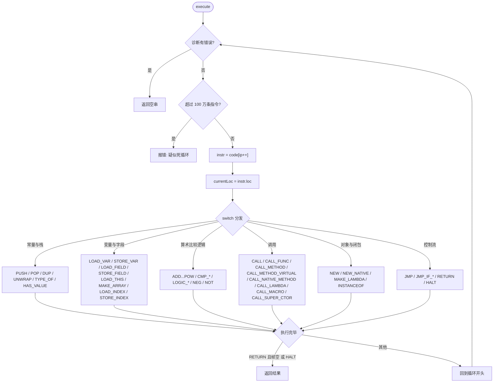

最后用 `1 + 2 * 3` 看一遍指令执行时栈的变化：

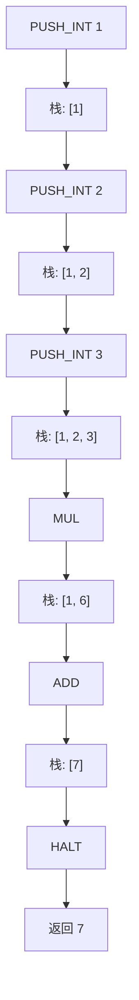

---

## 第六部分：关于 `GUIManager` 的设计范式

前五部分把脚本语言的一生完整地走了一遍：`Lexer` 切词、`Parser` 建树、`SemanticAnalyzer` 把关类型、`Compiler` 生成字节码、`Optimizer` 精简、`VM` 执行。但有一件事我们始终没有回答：一个 UI 脚本执行完之后，"结果"去哪了？执行 `1 + 2 * 3` 的 `VM` 会在栈顶留下数字 7，然后消失；而执行 `new CustomForm(...)` 的 `VM` 如果也只是留下一串被回收掉的临时对象，那玩家点按钮的时候，C++ 该找谁？

答案就是本部分的主角：`GUIManager`。它做的事情可以概括成一句话：**脚本负责"声明"，C++ 负责"注册与生命周期"**。脚本语言只是把 GUI 描述出来，而 `GUIManager` 把描述变成注册表里的真实对象，并负责它们从出生到关闭的全过程。

### 它到底在管什么

先看头文件里的核心 API（略去与业务无关的细节）：

```cpp
namespace LOICollection::form {
    enum class GUIManagerType : int {
        CustomForm = 1,
        MessageBox = 2,
        PaginatedForm = 3,
        ScriptForm = 4
    };

    class GUIManager {
    public:
        using ValueCallback = std::function<ll::Expected<frontend::ArrayRef>(Player&)>;
        using RequestCallback = std::function<ll::Expected<frontend::ArrayRef>(frontend::ArrayRef, Player&)>;
        using Callback = std::function<ll::Expected<void>(frontend::ArrayRef, Player&)>;

        static GUIManager& getInstance();

        // 加载与执行
        ll::Expected<void> load(const std::string& id, const std::string& path);
        ll::Expected<void> execute(const std::string& id);
        ll::Expected<void> open(
            const std::string& id, const std::string& formId, GUIManagerType type, Player& player,
            const frontend::ArrayRef& ctx = {}
        );

        // 四种表单的注册 / 注销 / 查询 / 切换
        void registerCustomFormUI(const std::string& id, std::shared_ptr<CustomFormClass::CustomFormHandle> form, Player& player);
        bool unregisterCustomFormUI(const std::string& id, Player& player);
        ll::Expected<std::shared_ptr<CustomFormClass::CustomFormHandle>> getCustomFormUI(const std::string& id, Player& player);
        ll::Expected<void> switchToCustomForm(const std::string& id, Player& player);
        // ... MessageBox / PaginatedForm / ScriptForm 与上面完全同构

        // C++ ↔ 脚本 数据桥
        void registerValue(const std::string& id, ValueCallback callback);
        void registerRequest(const std::string& id, RequestCallback callback);
        void registerCallback(const std::string& id, Callback callback);

        ll::Expected<frontend::ArrayRef> getValue(const std::string& id, Player& player);
        ll::Expected<frontend::ArrayRef> getRequest(const std::string& id, frontend::ArrayRef args, Player& player);
        ll::Expected<void> getCallback(const std::string& id, frontend::ArrayRef args, Player& player);
    };
}
```

三个值得注意的设计：

- **单例**：`getInstance()` 返回静态局部实例，拷贝与移动全部被 `delete`。全插件共享同一个 `GUIManager`，它天然是"全局状态中心"。
- **全部用 `ll::Expected` 传递错误**：查不到缓存、表单未注册、脚本报错……所有失败都走错误对象而不是异常。调用方必须显式处理 `has_value()`，这就把"可能失败"写进了函数签名里。
- **四种表单完全同构**：四个 `switchTo`、四个 `register`、四个 `unregister`、四个 `get`，只是底层注册表不同。这正是范式的核心——**一种生命周期，四种表单**。

### Impl：一张缓存 + 四张表单表 + 三张回调表

实现里所有状态都藏在 `Impl`（Pimpl 惯用法）中，头文件只暴露 `std::unique_ptr<Impl> mImpl`：

```cpp
struct GUIManager::Impl {
    std::unordered_map<std::string, std::shared_ptr<frontend::ir::BytecodeChunk>> cache;

    std::unordered_map<std::string, std::unordered_map<std::string, std::shared_ptr<CustomFormClass::CustomFormHandle>>> forms;
    std::unordered_map<std::string, std::unordered_map<std::string, std::shared_ptr<MessageBoxClass::MessageBoxHandle>>> boxs;
    std::unordered_map<std::string, std::unordered_map<std::string, std::shared_ptr<PaginatedFormClass::PaginatedFormHandle>>> paginatedForms;
    std::unordered_map<std::string, std::unordered_map<std::string, std::shared_ptr<ScriptFormClass::ScriptFormHandle>>> scriptForms;

    std::unordered_map<std::string, ValueCallback> values;
    std::unordered_map<std::string, RequestCallback> requests;
    std::unordered_map<std::string, Callback> callbacks;
};
```

这张图一目了然：

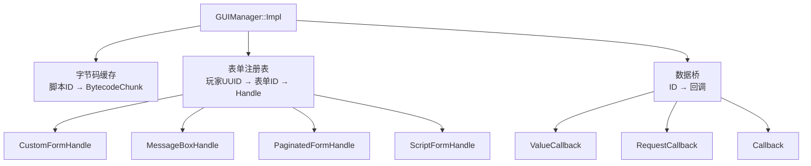

逐个解释为什么这样设计：

- **缓存是 `id → shared_ptr<BytecodeChunk>`**：脚本文件在 `load` 时只编译一次，之后任意玩家、任意次数 `open` 都复用同一份字节码。前五部分那条流水线（`Lexer → Parser → Semantic → Compiler → Optimizer`）的开销被摊到整个服务器生命周期里。
- **表单表是双层 map**：外层键是 `player.getUuid().asString()`，内层键是脚本里传入的表单 ID。玩家之间天然隔离——A 玩家打开了一个 `"main"` 菜单，绝不会顶掉 B 玩家的菜单；同一玩家同一 ID 再次注册时用 `insert_or_assign`，后创建的表单覆盖旧实例。
- **值全部是 `shared_ptr<Handle>`**：Handle 同时被两个世界持有——脚本对象 `Object::native` 和注册表。只有共享所有权，才能保证玩家点按钮时，原生回调里捕获的 Handle 一定还活着。
- **数据桥是全局的**：`values / requests / callbacks` 不与玩家绑定，它们是"能力"注册表；调用时才把 `Player&` 通过 `placeholders` 传进去。插件模块启动时注册一次，任何玩家的任何脚本都能使用。

### 生命周期：load → execute / open → switchTo → 自动注销

`load` 是前五部分的"收口"：

```cpp
ll::Expected<void> GUIManager::load(const std::string& id, const std::string& path) {
    auto content = this->readFile(path);
    if (!content.has_value())
        return ll::Unexpected(content.error());

    frontend::DiagnosticEngine diagnostics;
    frontend::ir::Compiler mCompiler(diagnostics);

    frontend::Lexer mLexer(content.value(), diagnostics);
    frontend::Parser mParser(mLexer, diagnostics);
    auto mAst = mParser.parse();
    if (diagnostics.hasErrors())
        return ll::makeStringError(diagnostics.getErrorMessage());

    frontend::SemanticAnalyzer analyzer(diagnostics);
    if (mAst->getType() == frontend::ASTNode::Type::Program)
        analyzer.analyze(static_cast<frontend::ProgramNode&>(*mAst));

    if (diagnostics.hasErrors())
        return ll::makeStringError(diagnostics.getErrorMessage());
    if (diagnostics.hasWarnings())
        return ll::makeStringError(diagnostics.getWarningMessage());

    auto bytecode = std::make_shared<frontend::ir::BytecodeChunk>(mCompiler.compile(*mAst));
    if (diagnostics.hasErrors())
        return ll::makeStringError(diagnostics.getErrorMessage());

    frontend::ir::Optimizer optimizer;
    optimizer.optimize(*bytecode);

    this->mImpl->cache.emplace(id, bytecode);
    return {};
}
```

注意两点：一是这里**警告也按错误处理**——能进缓存的脚本必须是"零警告"的干净脚本，免得每次运行时都被同一批警告刷屏；二是编译失败时 cache 不写入，`open` 时只会得到"找不到缓存"，而不是一份半坏的字节码。

`execute` 与 `open` 的区别值得一提：`execute` 以空上下文 `{}` 运行脚本，没有任何占位符，适合"注册类脚本"（比如集中注册 `value / request / callback` 的初始化文件）；而 `open` 总是注入 `Player&` 与 ctx，并把脚本执行后的副作用（已注册的表单）立即用 `switchTo*` 展示出来：

```cpp
ll::Expected<void> GUIManager::open(
    const std::string& id, const std::string& formId, GUIManagerType type, Player& player,
    const frontend::ArrayRef& ctx
) {
    frontend::DiagnosticEngine diagnostics;
    frontend::ir::VM mVM(diagnostics);

    if (this->mImpl->cache.contains(id)) {
        auto cached = this->mImpl->cache.at(id);

        auto mCtx = ctx ? ctx : std::make_shared<frontend::ArrayValue>();
        auto result = mVM.run(cached, { std::ref(player), mCtx });
        if (diagnostics.hasErrors())
            return ll::makeStringError(diagnostics.getErrorMessage());

        switch (type) {
            case GUIManagerType::CustomForm: return this->switchToCustomForm(formId, player);
            case GUIManagerType::MessageBox: return this->switchToMessageBox(formId, player);
            case GUIManagerType::PaginatedForm: return this->switchToPaginatedForm(formId, player);
            case GUIManagerType::ScriptForm: return this->switchToScriptForm(formId, player);
        }
    }

    return ll::makeStringError("open: No corresponding bytecode cache was found");
}
```

这里藏着整个范式的关键：`mVM.run(cached, { std::ref(player), mCtx })` 的第二个参数是 `Context`，它把两个占位符塞进 `placeholders`——`0` 号是 `Player&`，`1` 号是 ctx 数组。脚本里 `new CtxValue(索引)` 就是去 `placeholders.at(1)` 里取对应元素：

```cpp
ll::Expected<ObjectRef> makeCtxValue(const CallbackTypeValues& args, const CallbackTypePlaces& placeholders) {
    int index = std::get<int>(args[0]);

    auto ctxIt = placeholders.find(1);
    if (ctxIt == placeholders.end())
        return ll::makeStringError("CtxValue: no ctx parameter imported");

    auto ctxPtr = std::any_cast<ArrayRef>(&ctxIt->second);
    if (!ctxPtr || !*ctxPtr)
        return ll::makeStringError("CtxValue: invalid ctx parameter");

    if (index < 0 || index >= static_cast<int>((*ctxPtr)->elements.size()))
        return ll::makeStringError("CtxValue: ctx index out of range");
    // ... 拷贝对应元素并包装成 className = "CtxValue" 的 Object
}
```

脚本由此成为"表单工厂"：每次 `open` 都重新执行一遍，`new CustomForm("main", ...)` 的副作用就是往注册表里写入一个新 Handle；随后 `switchTo*` 从注册表取出这个 Handle 并 `show`。

`switchTo*` 四个函数同样同构，以 `switchToCustomForm` 的关闭回调为例：

```cpp
auto result = handle.value()->base->show([this, id, handle = handle.value(), player = std::ref(player)](ll::ui::ScreenSession::Result closeResult) mutable -> void {
    frontend::DiagnosticEngine diagnostics;
    frontend::CallbackTypeValues values;

    if (closeResult.has_value())
        values.emplace_back(static_cast<int>(*closeResult));
    else
        values.emplace_back(std::monostate{});

    [[maybe_unused]] auto cbResult = frontend::ir::VM::callFunctionRef(
        handle->show, values, frontend::Context{ player }.params, diagnostics
    );

    if (diagnostics.hasErrors()) {
        ll::io::LoggerRegistry::getInstance().getOrCreate("LOICollectionA")
            ->error("CustomForm::show callback: {}", diagnostics.getErrorMessage());
    }

    if (auto current = this->getCustomFormUI(id, player.get());
        current.has_value() && current.value() == handle)
        this->unregisterCustomFormUI(id, player.get());
});
```

这十几行里有两个非常值得学习的细节：

- **注销前校验身份**：`current.value() == handle` 保证"我注销的确实是刚才关闭的这个表单"。如果关闭回调执行期间，同 ID 已经注册了新的表单实例（比如脚本里又 `open` 了一次），就不会顺手把新实例删掉。这是异步世界里最常见的竞态，一行指针比较就化解了。
- **脚本错误只进日志**：UI 事件回调运行在 LeviLamina 的原生回调线程里，脚本报错不能抛异常炸掉整个服务器。所有从事件里发起的 `VM::callFunctionRef` 都遵循"诊断进 `DiagnosticEngine`、错误写 `LoggerRegistry`"的模式。

完整生命周期：

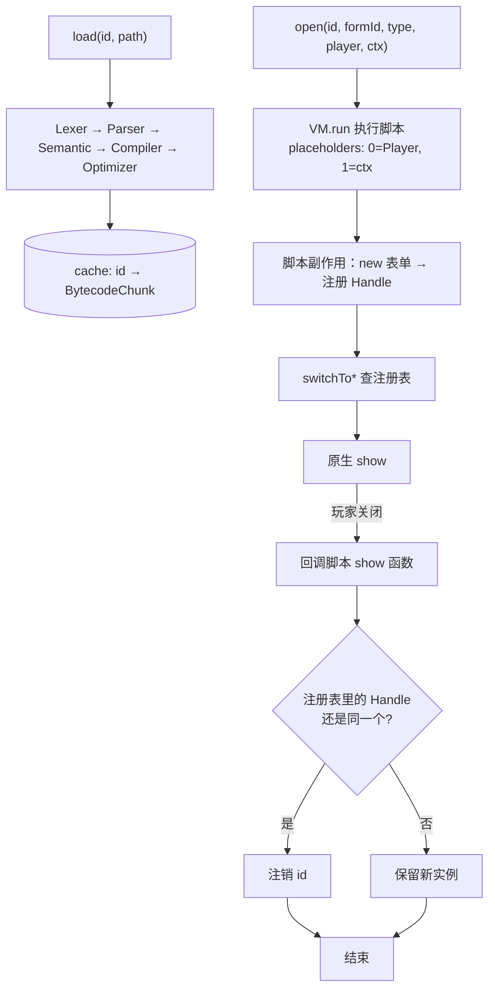

### value / request / callback：C++ 与脚本的数据桥

表单只是"壳"，真正的数据在 C++ 模块里。`GUIManagerBuiltin` 把这三种能力暴露成脚本函数：

```cpp
ll::Expected<TypedValue> value(const CallbackTypeValues& args, const CallbackTypePlaces& placeholders) {
    return GUIManager::getInstance().getValue(
        std::get<std::string>(args[0]),
        std::any_cast<std::reference_wrapper<Player>>(placeholders.at(0))
    );
}

ll::Expected<TypedValue> request(const CallbackTypeValues& args, const CallbackTypePlaces& placeholders) {
    return GUIManager::getInstance().getRequest(
        std::get<std::string>(args[0]),
        std::get<ArrayRef>(args[1]),
        std::any_cast<std::reference_wrapper<Player>>(placeholders.at(0))
    );
}

ll::Expected<TypedValue> callback(const CallbackTypeValues& args, const CallbackTypePlaces& placeholders) {
    auto result = GUIManager::getInstance().getCallback(
        std::get<std::string>(args[0]),
        std::get<ArrayRef>(args[1]),
        std::any_cast<std::reference_wrapper<Player>>(placeholders.at(0))
    );
    if (!result.has_value())
        return ll::Unexpected(result.error());

    return TypedValue{};
}
```

注册时，同一个函数名可以注册多份签名（由 `SemanticAnalyzer` 的重载解析在编译期选型）：

| 脚本函数 | 参数 | 对应 C++ API | 语义 |
| :--- | :--- | :--- | :--- |
| `GUIManager::value(id)` | 字符串 | `getValue(id, player)` | 取一个只读数据（数组） |
| `GUIManager::request(id, args)` | 字符串 + 数组 | `getRequest(id, args, player)` | 带参数查询 |
| `GUIManager::callback(id, args)` | 字符串 + 数组 | `getCallback(id, args, player)` | 执行一个动作 |
| `GUIManager::open(id, formId, type[, ctx])` | 3 个 + 可选数组 | `open(...)` | 执行脚本并打开表单 |
| `GUIManager::switchTo(id, type)` | 字符串 + 整数 | `switchTo*` | 直接切换到已注册表单 |

为什么三种回调统一返回 / 接收 `ArrayRef`？因为脚本数组 `ArrayValue` 就是 `std::vector<ValueNode::ValueType>`——一行可以放任意多个字段，多行可以表达列表；C++ 侧构造一个 `make_shared<ArrayValue>()` 就能传回去，不需要为每种数据定义一门"接口语言"。这是典型的最小公倍数设计：**两边都用最通用的容器，把语义留给调用者**。

插件侧的使用方式（C++）：

```cpp
GUIManager::getInstance().registerValue("menu.title", [](Player& player) -> ll::Expected<frontend::ArrayRef> {
    auto arr = std::make_shared<frontend::ArrayValue>();
    arr->elements.push_back(std::string("欢迎回来，") + player.getRealName());
    return arr;
});
```

脚本侧：

```cpp
title = GUIManager::value("menu.title")[0];
GUIManager::callback("menu.execute", [ "button1" ]);
GUIManager::open("menu", "main", 4);
```

注意 `GUIManager::open` 的玩家不是参数，而是从 `placeholders.at(0)` 里自动取出——脚本作者永远不需要知道 `Player&` 长什么样。

### 表单 Handle：NativeHandle 的封装范式

现在看"注册表里到底存了什么"。四种 Handle 都是 `NativeHandle` 的子类，而 `NativeHandle` 只是 AST 层的一个多态基类：

```cpp
struct NativeHandle {
    virtual ~NativeHandle() = default;
};

struct Object {
    std::string className;
    int classIndex = -1;
    std::unordered_map<std::string, ValueNode::ValueType> fields;
    std::shared_ptr<NativeHandle> native;
};
```

也就是说，脚本对象 `Object` 里的 `native` 字段是一个 `shared_ptr<NativeHandle>`，具体是什么类型由 `className` 标记。C++ 侧拿到对象后先查 `className`，再用 `static_cast<CustomFormHandle*>(self->native.get())` 还原。这是脚本世界与 C++ 世界的"边界线"。

四个 Handle 的定义（节选）：

```cpp
struct CustomFormHandle : LOICollection::frontend::NativeHandle {
    std::unique_ptr<ll::ui::CustomForm> base;
    LOICollection::frontend::FunctionRefPtr show;
};

struct MessageBoxHandle : LOICollection::frontend::NativeHandle {
    std::unique_ptr<ll::ui::MessageBox> base;
    LOICollection::frontend::FunctionRefPtr show;
};

struct PaginatedFormHandle : LOICollection::frontend::NativeHandle {
    std::string guiId;
    ll::ui::TextValue title;
    std::vector<std::string> elements;
    int pageSize = 10;
    int page = 1;
    int pageCount = 1;

    std::vector<std::shared_ptr<ll::ui::ObservableString>> labels;
    std::vector<std::shared_ptr<ll::ui::ObservableBoolean>> visible;
    std::shared_ptr<ll::ui::ObservableString> pageIndicator;
    std::shared_ptr<ll::ui::ObservableString> input;
    std::shared_ptr<ll::ui::ObservableBoolean> previousVisible;
    std::shared_ptr<ll::ui::ObservableBoolean> nextVisible;
    std::shared_ptr<ll::ui::ObservableBoolean> chooseVisible;

    std::string selection;
    int selectionIndex = 0;
    int selectionPage = 0;

    LOICollection::frontend::FunctionRefPtr show;
    std::unique_ptr<ll::ui::CustomForm> base;
};

struct ScriptFormHandle : LOICollection::frontend::NativeHandle {
    std::unique_ptr<ll::ui::CustomForm> base;
    std::unique_ptr<ll::ui::MessageBox> box;
    LOICollection::frontend::FunctionRefPtr show;

    std::function<LOICollection::frontend::ObjectRef()> makeResult;
    std::function<void(Player&)> onClosed;
    std::function<void(const ll::ui::MessageBox::Result&)> onBoxResult;

    bool pendingSubflow = false;
};
```

几个设计要点：

- **`base` 是 `unique_ptr`，Handle 本身是 `shared_ptr`**：原生表单对象归 Handle 独占，Handle 归脚本对象与注册表共享。所有权链只有一条，不会打架。
- **`show` 是 `FunctionRefPtr`**：这是脚本函数的"活引用"。`FunctionRef` 里保存着所属的 `BytecodeChunk`、方法体下标、参数名与捕获变量，所以表单关闭事件发生时，C++ 还能精确地把控制权交还给脚本。
- **`PaginatedFormHandle` 是有状态的**：它把分页状态（当前页、页大小、总页数）和"玩家最终选了什么"（`selection / selectionIndex / selectionPage`）全部放进 Handle。表单是异步的，玩家可能过十秒才点按钮，状态必须活在某个共享对象里，而不是活在早已退出的 `open` 调用栈上。
- **`ScriptFormHandle` 是扩展点**：`base` 和 `box` 二选一（CustomForm 或 MessageBox），`makeResult` 在关闭时生产结果对象，`onBoxResult` 处理 MessageBox 的选择，`onClosed` 做收尾，`pendingSubflow` 预留给"为了打开下一个表单而关闭当前表单"的子流程跳转——此时不触发 `show` 回调，直接走 `onClosed` 并注销。

为什么不直接让脚本持有 `ll::ui::CustomForm`？因为脚本侧只有 `Object` 这一种"对象"表示，字段表 + native 指针的二元结构已经是它能力的上限。把原生对象藏在 Handle 后面，C++ 侧就能随意扩展（比如给 MenuForm 塞业务字段），而脚本侧永远只需要认识 `className` 和 `fields`。

### 回调穿越：UI 事件如何回到脚本世界

前面反复出现 `VM::callFunctionRef`，现在看它内部——这是整个"双向互动"的心脏：

```cpp
ValueNode::ValueType VM::callFunctionRef(
    const FunctionRefPtr& func,
    const CallbackTypeValues& args,
    const CallbackTypePlaces& placeholders,
    DiagnosticEngine& diagnostics
) {
    // 校验 func / owner / bodyIndex / 参数个数...

    static thread_local size_t nativeCallDepth = 0;
    if (nativeCallDepth >= 64) {
        diagnostics.addError({ 0, 0, 0 }, "Nested native script call limit exceeded");
        return ValueNode::ValueType{};
    }
    ++nativeCallDepth;
    // RAII 归还深度...

    VM vm(diagnostics);
    vm.stack.clear();
    vm.frames.clear();
    vm.variables.clear();
    vm.variables = func->globals;

    Frame callee(func->owner->methodBodies[func->bodyIndex]);
    callee.hasThis = func->hasThis;
    if (func->hasThis) callee.thisObj = func->thisObj;
    callee.locals = func->captures;
    for (int i = 0; i < func->argCount; ++i)
        callee.locals[func->paramNames[i]] = args[i];

    vm.frames.push_back(std::move(callee));
    return vm.execute(func->owner, placeholders);
}
```

它的本质是：**为这一次事件重新造一个轻量 `VM`，把函数的闭包环境（captures）装进局部变量，把全局表复制一份，然后只执行这一个函数体。** 事件回调之间互不污染，但又能看到同一个脚本的全局状态。

- `thread_local nativeCallDepth` 防止"脚本回调里又触发原生事件，原生事件又回调脚本"这种重入无限加深，64 层封顶。
- `placeholders` 原样透传——`open` 时注入的 `Player&` 与 ctx 在事件发生时依然有效。

时序图：

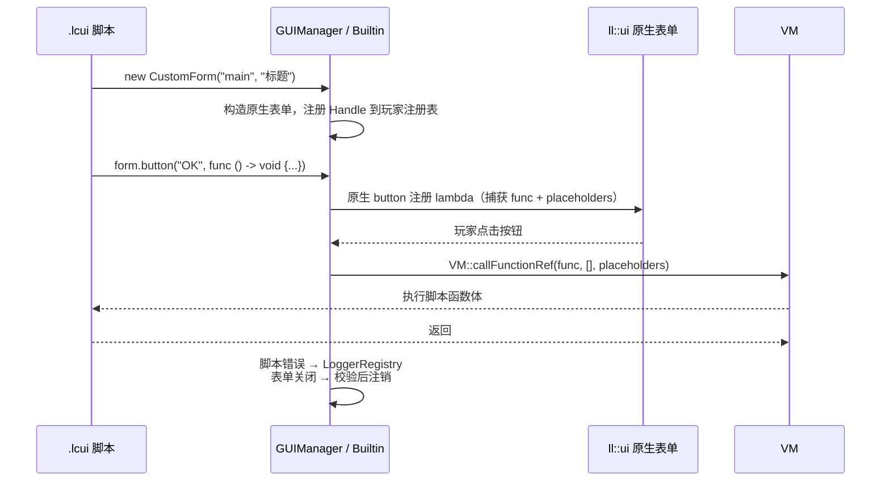

订阅（subscribe）走的是同一条路：`ObservableString` 的 `subscribe` 把脚本函数包进原生订阅回调，值变化时用 `VM::callFunctionRef(func, { value }, placeholders, diagnostics)` 通知脚本。整个 UI 体系里，**任何从原生层回到脚本层的入口都只有这一个函数**，错误处理策略因此高度统一。

顺带一提，这也是第一部分 `market.lcui` 里导航状态必须用 `GlobalValue` 的原因：按钮回调与 `show` 回调是两次独立的 VM 执行，普通变量按值捕获、修改传不过去，只有 `ObjectRef` 的字段修改是共享的。具体机制见第五部分"调用：帧的压栈与回弹"。

### 四种表单的注册 / 切换范式对比

| 表单类型 | 底层原生对象 | `show` 回调参数 | 关闭时返回什么 | 注册表 / 切换函数 |
| :--- | :--- | :--- | :--- | :--- |
| CustomForm | `ll::ui::CustomForm` | `closeReason`（int 或 none） | 只有原因值 | `forms` / `switchToCustomForm` |
| MessageBox | `ll::ui::MessageBox` | `MessageBoxResult` | `closeReason` + `selection` | `boxs` / `switchToMessageBox` |
| PaginatedForm | `ll::ui::CustomForm` + 分页状态 | `PaginatedFormResult` | `closeReason` + `selection` + `selectionIndex` + `page` | `paginatedForms` / `switchToPaginatedForm` |
| ScriptForm | `CustomForm` 或 `MessageBox` 二选一 | 自定义结果对象 | 由 `makeResult` 决定（如 `MenuFormResult`） | `scriptForms` / `switchToScriptForm` |

统一约束：`show` 回调必须恰好接收一个参数（`show callback must take exactly one parameter`），按钮回调不能接收参数（`button callback must not take any arguments`）；没有注册 `show` 的表单也能打开，关闭时只注销不回调。

以 Menu 模块为例看"扩展范式"。`MenuFormHandle` 直接继承 `ScriptFormHandle`，往里面加业务字段：

```cpp
struct MenuFormHandle : ScriptFormClass::ScriptFormHandle {
    ObjectRef action;
    int actionIndex = -1;
    int nextActionIndex = 0;
    int closeReason = 0;
    bool closeButtonAdded = false;
};

ObjectRef makeMenuFormResult(const std::shared_ptr<MenuFormHandle>& handle) {
    auto obj = std::make_shared<Object>();
    obj->className = "MenuFormResult";
    obj->classIndex = -1;
    obj->fields["closeReason"] = handle->closeReason;
    obj->fields["actionIndex"] = handle->actionIndex;
    obj->fields["action"] = handle->action ? TypedValue(handle->action) : TypedValue{};
    return obj;
}

ll::Expected<ObjectRef> makeMenuForm(const CallbackTypeValues& args, const CallbackTypePlaces& placeholders) {
    auto id = std::get<std::string>(args[0]);
    auto title = CustomFormOptionsClass::toTextValue(args[1]);
    auto& player = std::any_cast<std::reference_wrapper<Player>>(placeholders.at(0)).get();

    auto handle = std::make_shared<MenuFormHandle>();
    handle->base = std::make_unique<ll::ui::CustomForm>(player, *title);
    handle->makeResult = [handle]() -> ObjectRef { return makeMenuFormResult(handle); };

    form::GUIManager::getInstance().registerScriptFormUI(id, handle, player);
    // ... 包装成 className = "MenuForm" 的 Object 返回
}
```

菜单按钮的权限 / Score 检查也顺理成章地塞进原生按钮回调：通过则 `closeReason = 1`，没权限是 `2`，分数不足是 `3`，随后关闭表单；`switchToScriptForm` 的 `finish` 会调用 `makeResult` 把 `MenuFormResult` 交给脚本 `show` 回调。于是脚本侧写出来的东西就是：

```cpp
form = new MenuForm("main", "Menu");
form.button("商店", action1, func () -> void {
    GUIManager::open("shop", "main", 4);
}, new ButtonOptions());
form.show(func (result) -> void {
    if (result.closeReason == 1) [
        // 玩家选中了一个动作
    ]
});
```

### 可观察数据与选项转换层（为第七部分铺垫）

最后看 GUI 的"血肉"：控件值。脚本侧拿到的是包装类，例如：

```cpp
struct ObservableStringHandle : LOICollection::frontend::NativeHandle {
    std::unique_ptr<ll::ui::ObservableString> base;
};
```

构造时第一个参数是初始值，第二个是"客户端是否可写"；`setData` 直接穿透到 `ll::ui::ObservableString::setData`，`subscribe` 则把脚本函数注册成原生订阅回调。于是玩家在界面上改输入框，脚本里订阅的函数立刻被 `VM::callFunctionRef` 唤醒。

控件方法的参数则统一经过 `CustomFormOptionsClass` 的转换层，规则是一张很小的表：

| 脚本侧值 | 可转换成的原生值 |
| :--- | :--- |
| `string` / `UIRawMessage` / `ObservableString` / `ObservableUIRawMessage` | `ll::ui::TextValue` |
| `int` / `float` / `ObservableNumber` | `ll::ui::NumberValue` |
| `bool` / `ObservableBoolean` | `ll::ui::BooleanValue` |

转换层用 `std::visit` + `if constexpr` 做静态分发，例如：

```cpp
ll::Expected<ll::ui::TextValue> toTextValue(const TypedValue& value) {
    return std::visit([](auto&& arg) -> ll::Expected<ll::ui::TextValue> {
        using T = std::decay_t<decltype(arg)>;

        if constexpr (std::is_same_v<T, std::string>) {
            return ll::ui::TextValue(arg);
        } else if constexpr (std::is_same_v<T, ObjectRef>) {
            if (arg->className == "UIRawMessage")
                return ll::ui::TextValue(
                    static_cast<UIRawMessageHandle*>(arg->native.get())->base);
            if (arg->className == "ObservableString")
                return ll::ui::TextValue(
                    *static_cast<ObservableStringHandle*>(arg->native.get())->base);
            if (arg->className == "ObservableUIRawMessage")
                return ll::ui::TextValue(
                    *static_cast<ObservableUIRawMessageHandle*>(arg->native.get())->base);
        }

        return ll::makeStringError(
            "expected a string, UIRawMessage, ObservableString or ObservableUIRawMessage");
    }, value);
}
```

选项类的读取则统一走 `readOptional`：字段没设置或值是 `monostate`（none）就用原生默认值，设置了才转换。这带来一个很舒服的脚本体验——`new ButtonOptions()` 之后只用设置想改的字段：

```cpp
options = new ButtonOptions();
options.tooltip = "点击购买";
options.visible = new ObservableBoolean(true, false);
```

为什么要设这一层？因为脚本的 `TypedValue` 是 `std::variant<int, float, string, bool, ObjectRef, FunctionRefPtr, ArrayRef, monostate>`，而 LeviLamina 的控件参数是"值或 Observable"的变体。**中间层把"脚本对象 → 原生值"的映射集中在一处**，表单类的方法实现就只剩"取参 → 转换 → 调用原生 API"——这也是第七部分要带你亲手复刻的骨架。

### 设计范式总结

把第六部分压缩成三句话：

1. **注册表驱动生命周期**：脚本执行只是注册的副作用；表单从注册、显示到注销都由 `GUIManager` 统一管理，玩家与 ID 双维度隔离。
2. **Handle 持有原生对象**：脚本世界只认识 `className + fields + native`，C++ 世界通过 Handle 的子类化和 `static_cast` 还原具体类型，扩展（MenuForm）不用改动脚本语言。
3. **回调桥接两个世界**：所有"原生事件 → 脚本函数"的入口统一收敛到 `VM::callFunctionRef`，闭包环境、全局表、玩家上下文原样带过去，错误只进日志。

同时也要诚实地说说它的取舍：

- **单线程、无锁**：`GUIManager` 没有加任何锁，它信任 LeviLamina 的 UI 回调模型（同线程串行）。如果你要在自己的项目里多线程操作表单，需要自己加同步。
- **`open` 每次重跑脚本**：简单、可预测，但每次打开都要重新构建一遍表单对象。对菜单这种低频 UI 完全够用；高频刷新建议直接复用已注册实例。
- **表单关闭即注销**：一个表单的生命周期等于"从 `open` 到关闭"。想再次显示必须重新执行脚本——这是刻意的，因为它强制你以"声明"为单位思考，而不是维护一堆半死的表单对象。

到这里，你手里已经有两样东西了：一门完整的脚本语言（第一到第五部分），以及一个让脚本"活"在服务器里的注册表与生命周期框架（本部分）。第七部分，我们就用这两样东西，从零搭建一个属于你自己的 `声明式` GUI——把 `GUIManager` 这套范式真正变成"你也能写"的代码。

---

## 第七部分：如何创建你自己的 `声明式` GUI

前六部分一直在拆：拆词法、拆语法、拆语义、拆编译、拆执行、拆注册表。这一部分反过来，只做一件事——装。

装什么？装一个属于你自己的"表驱动渲染器"：输入是一份声明（纯数据），输出是 `GUIManager` 里活着的表单。声明长什么样由你定，渲染逻辑怎么写由你定，`GUIManager` 负责让它活到玩家关闭的那一刻。

我将完成我开头提出的第一个承诺：从零实现一个声明式 GUI。

### 先看两个真实产物

`docs/md/data.md` 里存着两个完整的 lcui 文件。先看 menu.lcui（节选，已删去重复部分）：

```cpp
// 1. 先声明"动作"数据
button1 = new MenuItemData();
button1.type = "button";
button1.title = "Button 1";
button1.id = "Button1";
button1.run = [ "say Button1" ];
button1.permission = 0;

// 2. 再声明"表单"：控件绑数据，回调收结果
form = new MenuForm("main", "Menu Example");
form.label("This is a menu example", new TextOptions());
form.button("Button 1", button1, func () -> void {
}, new ButtonOptions());
form.closeButton();
form.show(func (result) -> void {
    if (result.closeReason == 2) [
        mc::runCmd("say No permission");
    :
        if (result.closeReason == 3) [
            mc::runCmd("say No score");
        ]
    ]
});

// 3. 对话框同理
confirmAction = new MenuItemData();
confirmAction.type = "button";
confirmAction.title = "Confirm";
confirmAction.run = [ "say Confirm" ];

cancelAction = new MenuItemData();
cancelAction.type = "button";
cancelAction.title = "Cancel";
cancelAction.run = [ "say Cancel" ];

box = new MenuMessageBox("Menu1", "Menu 1");
box.body("This is a menu 1");
box.button1("Confirm", confirmAction);
box.button2("Cancel", cancelAction);
box.show(func (result) -> void {
});
```

再看 shop.lcui：

```cpp
mainBuy = new ShopData();
mainBuy.id = "MainBuy";
mainBuy.type = "buy";
mainBuy.title = "Buy Shop Example";
mainBuy.content = "This is a shop example";
mainBuy.exitCommand = "say Exit Shop";
mainBuy.scoreCommand = "say No score";

apple = new ShopItemData();
apple.type = "commodity";
apple.title = "Apple";
apple.introduce = "A red apple";
apple.number = "Buy number";
apple.id = "minecraft:apple";

appleScore = new ScoreRequirement();
appleScore.objective = "money";
appleScore.value = 100;
apple.scores = [ appleScore ];

mainBuy.items = [ apple ];

form = new ShopForm("MainBuy", mainBuy);
form.show(func (result) -> void {
    if (result.closeReason == 1) [
        if (result.resultCode == 1) [
            mc::runCmd(result.shop.scoreCommand);
        ]
    ]
});
```

两份脚本的长相几乎一样：先造数据对象（`MenuItemData` / `ShopData`），再造表单对象（`MenuForm` / `ShopForm`），最后 `show` 收结果。界面长什么样，由数据决定；数据怎么变成界面，由类库决定。这就是声明式的起点——**描述与渲染分离**。

`MenuForm` 和 `ShopForm` 是 LOICollectionA 已经替你写好的渲染器。这一部分要做的，就是把这个过程再往下推一层：不用这些业务类，而是自己写一个渲染器，让任何"描述"都能变成表单。

### 从零写一个表驱动渲染器

先定义描述格式。既然是"声明式"，描述就该是纯数据。用两个类把它框起来：

```cpp
// 一个表单的声明：ID、标题、条目列表
class MenuDeclaration {
public:
    id = "";
    title = "";
    items = [];
}

// 一个条目的声明：文字、类型、目标、动作名
class MenuItemDeclaration {
public:
    text = "";
    type = "button"; // button | open | close | label
    target = "";
    formType = 1;    // 1=CustomForm 2=MessageBox 3=PaginatedForm 4=ScriptForm
    actionName = "";
    permission = 0;
    scores = [];
}
```

注意一个刻意的选择：描述里不存 lambda，只存**动作名**。动作是行为，行为属于渲染器这一侧；描述只回答"是什么"，不回答"怎么做"。这个分工和第六部分的 `GUIManager` 如出一辙——注册表存能力，调用时再按名字取。

所以先写一个动作注册表。它就是一个挂在 `GlobalValue` 上的数组，成对存放"名字 → 函数"：

```cpp
actions = new GlobalValue();
actions.value = [];

emptyAction = func () -> void {};

func registerAction(name, callback) -> void {
    actions.value.push(name);
    actions.value.push(callback);
}

func findAction(name) {
    i = 0;
    while (i < actions.value.length) [
        if (actions.value[i] == name) [
            return actions.value[i + 1];
        ]
        i += 2;
    ]
    return emptyAction;
}
```

`actions.value.push(...)` 把"名字、函数"成对追加到数组末尾（`push` 就是数组的标准追加方法，底层等价于第五部分 `STORE_INDEX` 在 `i == size` 处写入）。找不到名字时返回一个空动作，保证调用方永远拿得到函数，不会在运行期炸掉。

然后写渲染器。它只做四件事：建表单、遍历条目、按类型分派、注册 show 回调：

```cpp
func renderMenu(declaration) -> void {
    form = new CustomForm(declaration.id, declaration.title);

    for (item in declaration.items) [
        if (item.type == "open") [
            form.button(item.text, func () -> void {
                GUIManager::switchTo(item.target, item.formType);
            }, new ButtonOptions());
        :
            if (item.type == "close") [
                form.closeButton();
            :
                if (item.type == "label") [
                    form.label(item.text, new TextOptions());
                :
                    action = findAction(item.actionName);
                    form.button(item.text, func () -> void {
                        allowed = GUIManager::request("my.check", [ item.permission, item.scores ]);
                        if (allowed[0]) [
                            action();
                        ]
                    }, new ButtonOptions());
                ]
            ]
        ]
    ]

    form.show(func (result) -> void {
    });
}
```

几个要点：

- `new CustomForm(declaration.id, declaration.title)` 这一行就是第六部分的注册动作：表单一出生就进了 `GUIManager`，玩家关闭后自动注销。
- `open` 分支里的 lambda 捕获的是 `item` 这个 `ObjectRef`，不是 `target` 的副本——第五部分刚讲过，对象字段的修改是共享的，这里读取 `item.target` 当然是活的。
- 按钮回调里先 `findAction` 再执行，权限与 Score 检查被放在描述字段里、由 `GUIManager::request("my.check", ...)` 交给 C++ 判定。`my.check` 这个 ID 现在还不存在，它是你自己的插件要注册的回调，第六部分的 `registerRequest` 就是干这个的。
- `form.show(func (result) -> void {})` 必须接收一个参数，这是 CustomForm 的硬性约定。

数据流向画出来是这样：

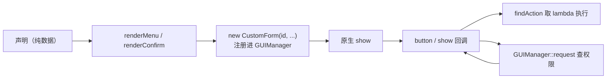

对话框也如法炮制。`MessageBox` 没有"动作"概念，只有两个按钮，所以渲染器负责把选择翻译成动作：

```cpp
class ConfirmDeclaration {
public:
    id = "";
    title = "";
    content = "";
    confirmText = "";
    cancelText = "";
    confirmAction = "";
    cancelAction = "";
}

func renderConfirm(declaration) -> void {
    box = new MessageBox(declaration.id, declaration.title);
    box.body(declaration.content);
    box.button1(declaration.confirmText);
    box.button2(declaration.cancelText);

    box.show(func (result) -> void {
        if (result.selection) [
            action = findAction(declaration.cancelAction); // 按钮 2
            action();
        :
            action = findAction(declaration.confirmAction); // 按钮 1（或未选择）
            action();
        ]
    });
}
```

到这里，渲染器已经能用了。声明两份菜单，注册两个动作，跑同一个 `renderMenu`：

```cpp
registerAction("hello", func () -> void {
    mc::runCmd("say Hello");
});

registerAction("buy.apple", func () -> void {
    GUIManager::callback("shop.buy", [ "minecraft:apple", 1 ]);
});

mainMenu = new MenuDeclaration();
mainMenu.id = "example.main";
mainMenu.title = "示例菜单";

shopItem = new MenuItemDeclaration();
shopItem.text = "打开商店";
shopItem.type = "open";
shopItem.target = "example.shop";
shopItem.formType = 1;

helloItem = new MenuItemDeclaration();
helloItem.text = "打招呼";
helloItem.type = "button";
helloItem.actionName = "hello";

quitItem = new MenuItemDeclaration();
quitItem.text = "退出";
quitItem.type = "close";

mainMenu.items = [ shopItem, helloItem, quitItem ];

shopMenu = new MenuDeclaration();
shopMenu.id = "example.shop";
shopMenu.title = "商店";

buyItem = new MenuItemDeclaration();
buyItem.text = "购买苹果";
buyItem.type = "button";
buyItem.actionName = "buy.apple";

shopMenu.items = [ buyItem, quitItem ];

renderMenu(mainMenu);
renderMenu(shopMenu);
```

把这份脚本存成 `mygui.lcui`，C++ 侧只需要两行：

```cpp
form::GUIManager::getInstance().load("mygui", "plugins/myplugin/mygui.lcui");
form::GUIManager::getInstance().open("mygui", "example.main", form::GUIManagerType::CustomForm, player);
```

`GUIManager::open` 执行一遍脚本，两个表单都会注册；然后按 `formId` 找到 `example.main` 并显示。点"打开商店"时，`switchTo` 直接切到同一次执行里注册的 `example.shop`，不需要重新跑脚本。

这就是"声明式"最小但完整的样子：**一份描述 + 一个渲染器 + 一个注册表**。

### 你会踩的坑

这一节的坑全部来自前六部分的机制，现在集中列一次：

1. **表单关闭即注销**。`example.main` 被玩家关闭后，注册表里就没有它了。想再打开，只能重新执行脚本（`open`），不能指望 `switchTo` 还能找到它。
2. **动作注册表要在渲染前填完**。`findAction` 找不到名字时返回空动作，界面不会报错，但按钮会"没反应"。排查时先确认 `registerAction` 的执行顺序。
3. **Observable 要和控件一一对应**。`form.label(item.text, ...)` 传的是 `ObservableString` 时，一个 observable 只喂给一个控件；同一个 observable 同时绑两个控件，值会互相覆盖，行为很难猜。
4. **回调之间共享状态要用 `GlobalValue`**。两个按钮的 lambda 各自捕获一份快照；想让一个回调的修改被另一个回调读到，就把它放进 `ObjectRef` 的字段里（第五部分的结论，这里不重复展开）。
5. **`MessageBoxResult.selection` 的 `0` 和 `none` 都是假值**。上面的 `renderConfirm` 在"未选择直接关闭"时也会走 confirm 分支；正式项目里应该先看 `closeReason` 再决定要不要执行动作。

### JSON 表单与 DDUI 的可行范式

在这一篇幅中我会给出一个完整的设计范式，但仅供参考，并非真实项目中完全可以套用的模板。

在开始之前，我需要给出一个假设：接下来的内容均为最理想模型。

```json
{
    "menuId": {
        "observable": [
            {
                "id": "title",
                "value": "This is a title",
                "type": "string"
            },
            {
                "id": "button1",
                "value": "button1",
                "type": "string"
            },
            {
                "id": "slider1",
                "value": "slider1",
                "type": "string"
            },
            {
                "id": "slider_value",
                "value": 0,
                "type": "number"
            }
        ],
        "title": "title",   // 传入 observable id
        "customize": [
            {
                "label": "button1",
                "run": [
                    "say button1",
                    "say {slider_value}" // 支持 observable id 取值
                ],
                "options": {
                    "disabled": false, // 同样支持 observable id
                    "tooltip": "this is a tooltip", // 同样支持 observable id
                    "visible": true // 同样支持 observable id
                },
                "change": {
                    "button1": "no button1" // 这里改变对应 observable id 的 value
                },
                "close": false, // 这里不关闭菜单
                "type": "button"
            },
            {
                "label": "slider1",
                "value": "slider_value", // 仅支持 observable id
                "options": {
                    "description": "description", // 同样支持 observable id
                    "disabled": false, // 同样支持 observable id
                    "step": 1, // 同样支持 observable id
                    "visible": true // 同样支持 observable id
                },
                "type": "slider"
            }
        ],
        "show": {
            "run": [
                "say close form"
            ]
        },
        "type": "custom"
    }
}
```

### 扩展成你自己的框架

`renderMenu` 只是函数。想当框架用，得回答三个问题：动作怎么统一管理、条件检查放哪、什么时候该用表驱动。

动作管理，上面的动作注册表就是答案。它和 `GUIManager` 的 `value / request / callback` 是同一个模式：**注册表存能力，名字是接口**。好处是描述文件里只剩字符串和数字，可以随意序列化成 JSON、存进配置、甚至由别的插件生成——渲染器一行都不用改。

条件检查，把 `permission` 和 `scores` 放进描述（上面的 `MenuItemDeclaration` 已经预留了这两个字段），C++ 侧注册一个 `request` 回调：

```cpp
GUIManager::getInstance().registerRequest("my.check", [](frontend::ArrayRef args, Player& player) -> ll::Expected<frontend::ArrayRef> {
    int permission = std::get<int>(args->elements[0]);
    bool allowed = static_cast<int>(player.getCommandPermissionLevel()) >= permission;

    auto result = std::make_shared<frontend::ArrayValue>();
    result->elements.emplace_back(allowed);
    return result;
});
```

这和第六部分 `MenuForm` 的 actionButton 是同一条思路，只是把检查条件从硬编码变成了描述字段：渲染器只负责"描述 → 检查 → 放行"的骨架，具体规则永远留在 C++ 侧。

至于什么时候该用表驱动，判断标准只有一条：**渲染器省下的代码，是否超过它引入的抽象成本**。

- 交互复杂、状态多（分步表单、跨表单传参），直写 `CustomForm` 更清楚。渲染器为了覆盖所有情况，反而会膨胀成一门小语言。
- 表单同构、量大（菜单、商品列表、黑名单管理），一份渲染器 + 多份数据，新增界面只是加数据。

`Menu` 和 `Shop` 在 LOICollectionA 里选择了后者——`MenuForm` / `ShopForm` 就是官方版渲染器；market.lcui 则是手写直写的代表。两种都活着，说明这不是二选一的问题，而是同一个体系里不同粒度的选择。

## 总结：回到开头

教程开头摆了一个 1.14.0 的 Menu JSON：一个 SimpleForm 要写满 `title`、`content`、`customize`，每个按钮的 `run` 都是一串命令字符串。那时我提出的难题是——让按钮文字随玩家金币数实时变化，传统 JSON 表单几乎不可能；当时给的出路是写 C++ 模组或 .js 脚本，但也留了一条后路：传统 JSON 表单在 `DDUI` 上并非彻底没救，第七部分会给出一个可行范式。

现在走到结尾，两个答案都摆在桌上了：一个是在"JSON 表单与 DDUI 的可行范式"里给出的设计——`observable` 数据层、控件按 id 引用、`{id}` 插值、`change` 改值、`show.run` 收尾；另一个是第七部分从零搭出来的 lcui 表驱动渲染器。把三者摆在一起，差异一目了然：

| 维度 | 传统 JSON 表单（1.14.0） | 新 JSON 范式 | lcui 声明式 GUI（第七部分） |
| :--- | :--- | :--- | :--- |
| 描述载体 | 静态嵌套 JSON，`title`/`content`/`customize` 全部写死 | JSON + `observable` 数据层，控件按 observable id 引用 | lcui 脚本：声明类对象 + 动作注册表 |
| 动态数据 | 无；文本与数值都是字面量 | `observable` 集中声明，`run`/`options` 用 `{id}` 插值 | `ObservableString`/`Number`/`Boolean` 直接绑定控件，`subscribe`/`setData` 回流 |
| 事件与变更 | 按钮只有 `run` 命令，`permission`/`scores` 写死 | `change` 按 observable id 改值，`close` 可控，`show.run` 收尾 | 按钮/`show` 回调是脚本函数；动作注册表按名取；权限走 `GUIManager::request` |
| 生命周期 | 表单开与关，没有注册概念 | 描述仍是数据，需要配套运行时去解释（理想模型） | `GUIManager` 注册表 + `open`/`switchTo` + 关闭自动注销 |
| 扩展成本 | 加一种控件 = 改 JSON 结构 + 改解析逻辑 | 控件类型仍是枚举，但数据与行为已经解耦 | 加一种控件 = 改渲染器函数，语言侧不动 |
| 表达力 | 命令字符串 | 数据 + 引用 + 变更 | 完整语言：变量、类、循环、lambda |
| 定位 | 配置文件 | 数据驱动的设计范式（理想模型） | 声明式 GUI 系统 |

这张表读下来，最明显的变化是**描述在变活**。1.14.0 的 JSON 里，`"title": "'Menu Example'"` 就是一串写死的字符；你的范式把值抽进 `observable`，控件只留一个 id 引用，`run` 里甚至可以用 `{slider_value}` 去取运行时数据——描述第一次"会变"了。lcui 再往前走一步，`ObservableString` 本身就是活对象，`setData` 一改，界面立刻跟着变。

随之而来的是**渲染在变可编程**。旧 JSON 的渲染逻辑藏在 Menu 的 C++ 代码里，加一个字段就要改一处解析；而我给出的范式需要一套运行时去解释 `observable` 引用、`change`、`show.run`——这也是为什么我把它标注为"最理想模型"，因为这套运行时的复杂度并不比一个 lcui 渲染器低。而 lcui 的答案是把渲染器本身变成脚本：`renderMenu` 就是一个普通函数，改渲染器等于改脚本，不需要动 C++。

开头我还说过另一句话："就算能实现，那整体的设计范式也极为复杂，难以阅读。"新的 JSON 范式恰好验证了这一点——它证明了传统 JSON 表单在 `DDUI` 上**可行**，但代价是描述本身变得复杂：`observable` 要集中管理，控件要按 id 引用，值的变化要靠 `change` 转发。这不是否定这个范式，恰恰相反，它用纯数据证明了"描述 + 渲染器 + 注册表"这套三要素在 JSON 世界里也能成立：`observable` 数组是描述，解释它的运行时是渲染器，`GUIManager` 仍然是注册表。lcui 做的事，只是把中间那层运行时从"想象中的解释器"变成了"你亲手写的函数"。

所以，从 JSON 表单到声明式 GUI 系统，变的从来不是数据格式，而是**谁来解释描述**。1.14.0 的 JSON 由写死的解析器解释，新范式由一套理想的运行时解释，lcui 由你自己写的渲染器解释——解释权每下沉一层，界面就活一分。教程开头许诺过：带你从头实现一个自己的声明式 GUI。现在描述、渲染器、注册表，三样东西你都亲手写过一遍，这个许诺就算兑现了。剩下的最后一步，就是让你自己的那份 JSON，也活起来。
